# Onboarding funnel instrumentation — 2026-09-19

Point-in-time answer to: how much of the **entire** onboarding funnel can Kody
reasonably track so weekly product decisions are evidence-backed?

This is a snapshot of the tree on this date. It does not add events. It does not
propose PostHog, a new analytics product, or a new primitive. The existing
pattern — write-once stamps on `users`, a COUNT query on `/admin/insights`, and
Fathom for anonymous page traffic — already covers the decisions that matter. A
few missing stamps are the gap, not a new pipeline.

**Short answer.** Signed-in activation from signup through first package and
paid plan is already tracked well enough for a weekly review. Anonymous visit
through signup stays cookieless Fathom and must not be joined to accounts.
Cohort retention (returned on day 7, not "active sometime in the last 7 days"),
second-agent timing, and checkout _intent_ are the holes that change decisions.
Those holes fit the current `users` stamp pattern. Do not put funnel points on
`USAGE_EVENTS`.

## 1. Current onboarding surfaces

The product onboarding path is a signed-in wizard, a derived checklist, a
separate Waiting queue, and a handful of account pages. Hosted platform OAuth is
not the connect path. New MCP connects are bring-your-own. Invite codes are gone
(`packages/worker/migrations/0058-drop-invites.sql`). Public launch cohort
starts `2026-09-10` (`packages/worker/universal/platform-open.ts`).

Contract and architecture:

- [`packages/worker/universal/onboarding-process.ts`](../../packages/worker/universal/onboarding-process.ts)
- [`docs/contributing/architecture/onboarding.md`](../contributing/architecture/onboarding.md)
- [`docs/guides/onboarding.md`](../guides/onboarding.md)
- [`docs/use/waiting.md`](../use/waiting.md)

| Stage in the product               | Route                                                                                                                                    | Code                                                                                                                                                                      |
| ---------------------------------- | ---------------------------------------------------------------------------------------------------------------------------------------- | ------------------------------------------------------------------------------------------------------------------------------------------------------------------------- |
| Marketing / anonymous site         | public SSR pages                                                                                                                         | Fathom script only when `FATHOM_SITE_ID` is set (`packages/worker/src/app/ssr-render` tests)                                                                              |
| Signup and login                   | `/signup`, `/login`                                                                                                                      | `packages/worker/client/routes/login.tsx`; password handler `packages/worker/src/app/handlers/auth.ts`; OAuth handler `packages/worker/src/app/handlers/auth-provider.ts` |
| OAuth signup providers             | `/auth/{github,google,x,discord}/callback`                                                                                               | [`docs/contributing/social-login.md`](../contributing/social-login.md)                                                                                                    |
| Email verify                       | `/pending-verification`                                                                                                                  | checklist item `verify-email`; `users.email_verified_at`                                                                                                                  |
| Wizard index                       | `/onboarding`                                                                                                                            | redirects to the first unfinished step; client `packages/worker/client/routes/onboarding.tsx`; loader `packages/worker/src/app/handlers/onboarding.ts`                    |
| Step 1 — Connect your agent        | `/onboarding/step-1`, `/onboarding/step-1/:agent`                                                                                        | picker + MCP setup; `packages/worker/client/routes/onboarding-mcp-client-*.tsx`                                                                                           |
| Step 2 — Make something useful     | `/onboarding/step-2` (`/onboarding/step-2/:service` redirects here)                                                                      | one copy prompt; completes on first `search` or an existing access win (memory, execute, or saved package)                                                                |
| Step 3 — Connect a second agent    | `/onboarding/step-3`, `/onboarding/step-3/:agent`                                                                                        | same picker, same-ecosystem hosts greyed; gift copy when the Standard gift is still unreceived                                                                            |
| Checklist                          | derived, not its own page                                                                                                                | `verify-email`, `connect-agent`, `give-access`, `connect-second-agent`, `install-starter`                                                                                 |
| Dismiss                            | Get started dismiss                                                                                                                      | `users.onboarding_checklist_dismissed_at` (`migrations/0015-users-onboarding-checklist-dismissed-at.sql`)                                                                 |
| Waiting queue                      | `/account/waiting`, MCP `waitingSummary`                                                                                                 | `packages/worker/universal/waiting.ts`, `packages/worker/src/mcp/waiting/derive-waiting.ts`                                                                               |
| First-use cards (not wizard steps) | Waiting only                                                                                                                             | `search`, `memory`, `execute`, `package`, `job`, `integration`, `secret`, `discord`                                                                                       |
| Inbound MCP hosts                  | `/account/connections`                                                                                                                   | grouped by display name; not `users.mcp_client_name` and not user-minted confidential clients (`/account/mcp-oauth-clients`)                                              |
| Provider connections               | `/account/connections/new`, `/connect/oauth`                                                                                             | user-lane OAuth apps, separate from signup identity providers                                                                                                             |
| Discord                            | `/discord`                                                                                                                               | `packages/worker/client/routes/discord.tsx`; one Connect Discord action; official guild membership is a live probe                                                        |
| Billing                            | `/account/billing`, checkout `POST /account/billing/checkout.json`, success `/account/billing/success`, portal `/account/billing/portal` | `packages/worker/src/app/handlers/account-billing.ts`                                                                                                                     |
| First-win email guide              | not a wizard step, not a checklist item                                                                                                  | `docs/guides/first-win.md`; MCP `guide:first_win`                                                                                                                         |
| Lifecycle mail (not the wizard)    | hourly `usage_entitlement_alert` lane                                                                                                    | states in `packages/worker/src/usage/campaign-states.ts`                                                                                                                  |

Step 2's prompt tells the agent to `search({ entity: "guide:onboarding" })`.
Step 3's prompt tells the new agent to
`search({ entity: "guide:portability" })`. The page does not observe which
entity was retrieved. It observes that _some_ successful search (or an access
win) happened.

`hasSecondMcpClient` is unique inbound OAuth `clientId`s ≥ 2
(`hasSecondConnectedMcpClient` in
`packages/worker/universal/connected-mcp-agents.ts`). It is not stored on
`users`. Revoking grants can move the count backward.

## 2. What we already track

There is no PostHog (or any other product-analytics SDK) in the repo.

### Fathom

Cookieless pageviews on production SSR when `FATHOM_SITE_ID=WKKSDJGN`
(`packages/worker/wrangler.jsonc`). Unset in local, preview, and test.
Dashboard: app.usefathom.com, site **kody.codes**. Setup notes:
[`docs/contributing/operator-accounts.md`](../contributing/operator-accounts.md).

Custom events, closed set in `packages/worker/universal/fathom-events.ts`, fired
from `packages/worker/client/fathom-events.ts`:

| Event             | When                                                                                                |
| ----------------- | --------------------------------------------------------------------------------------------------- |
| `signup_started`  | `/signup` view, once per page instance (`login.tsx`)                                                |
| `account_created` | password signup success, or post-OAuth redirect carrying `?accountCreated=1` after the script loads |

No emails, secrets, or package contents. Blocked script or adblock drops the
event. The query param is stripped only after Fathom accepts `account_created`.
Fathom events are not joinable to `users`.

First-touch UTM is **not** a Fathom dimension. The browser keeps it in
`sessionStorage` (`packages/worker/universal/first-touch-attribution.ts`) and
writes it once onto the user at signup.

### Workers Analytics Engine

Production bindings in `packages/worker/wrangler.jsonc` (preview datasets use
the `_preview` suffix; PR worker configs use `_pr`):

| Binding                           | Dataset                                | Funnel use                                                                                                                          |
| --------------------------------- | -------------------------------------- | ----------------------------------------------------------------------------------------------------------------------------------- |
| `USAGE_EVENTS`                    | `kody_usage_events`                    | Per-user metered work. Index is user id. Rolled hourly into D1 `usage_rollups`. **Not** a funnel log.                               |
| `FLAG_EXPOSURES`                  | `kody_flag_exposures`                  | Measured feature-flag exposures. User id in `index1` / `blob1`.                                                                     |
| `EMAIL_EVENTS`                    | `kody_email_events`                    | `email_send`, `email_receive`, `email_delivery` plus provider outcome. User id.                                                     |
| `MCP_PROTOCOL_EVENTS`             | `kody_mcp_protocol_events`             | Every authenticated `/mcp` request: lane, method, protocol, client name/version, **user id**, request host. Sampled at volume.      |
| `PACKAGE_INVOKE_SPECIFIER_EVENTS` | `kody_package_invoke_specifier_events` | Specifier form migration. **No** user, package, or specifier text.                                                                  |
| `EXECUTE_INTERPRETABLE_EVENTS`    | `kody_execute_interpretable_events`    | Share of execute modules that are pure glue. **No** user or source.                                                                 |
| `MCP_SEARCH_EVENTS`               | `kody_mcp_search_events`               | Search wall-clock and phase tiles. **No** user, query, conversation, or entity id. Cannot answer "who searched `guide:onboarding`". |

`USAGE_EVENTS` event types (`packages/worker/universal/usage-event-types.ts`):
`execute`, `package_export`, `package_static_call`, `job_run`, `workflow_run`,
`realtime_session`, `outbound_fetch`, `email_send`, `email_received`,
`dynamic_worker_day`, `dynamic_worker_invoke`, `durable_object_gb_seconds`,
`durable_object_rows_read`. Schema and query rules:
[`docs/contributing/architecture/usage-metering.md`](../contributing/architecture/usage-metering.md).
Counts must use `sum(_sample_interval)`. Writes are capped around 250
`writeDataPoint` calls per invocation (the static-call buffer stops at 200 so
other events have headroom). Overflow is dropped.

Successful `execute` also stamps `users.first_execute_at`
(`packages/worker/src/usage/record-usage.ts` → `stampFirstExecute`). Successful
`search` stamps `users.first_search_at`
(`packages/worker/src/mcp/tools/search-tool-runner.ts`). Those stamps are the
funnel. The Analytics Engine points are not.

### Sentry

Error and trace destination, not a funnel. Production traces sample rate is 0
because Workers OTLP already exports to the `sentry-otlp-traces` destination.
Signed-in error events set the user to the stable id only
(`docs/contributing/architecture/request-lifecycle.md`). No email.

### D1 columns that are the funnel

Migration `0029-users-attribution-activation.sql` plus
`0042-users-first-search-at.sql`:

| Column                                                  | Meaning                                                                                          |
| ------------------------------------------------------- | ------------------------------------------------------------------------------------------------ |
| `created_at`                                            | account exists                                                                                   |
| `utm_source` … `utm_term`                               | first-touch, write-once at signup                                                                |
| `first_touch_landing_path`                              | landing path at first touch                                                                      |
| `first_touch_referrer`                                  | referrer at first touch                                                                          |
| `email_verified_at`                                     | verify completed                                                                                 |
| `first_mcp_connected_at`                                | first authenticated MCP connection                                                               |
| `mcp_client_name`                                       | first-touch client name, truncated to 200 chars; not the connections list                        |
| `first_search_at`                                       | first successful search, any entity                                                              |
| `first_execute_at`                                      | first successful MCP execute-tool run; jobs, exports, workflows, and other surfaces do not stamp |
| `first_saved_package_at`                                | first saved package                                                                              |
| `last_active_at`                                        | latest UTC day with activity. Overwritten. Not a history.                                        |
| `onboarding_checklist_dismissed_at`                     | checklist dismissed                                                                              |
| `plan`                                                  | manual / operator plan, including `max`                                                          |
| `stripe_plan`, `stripe_price_id`                        | catalog-paid plan                                                                                |
| `entitlement_ladder`                                    | `public` vs `legacy`                                                                             |
| `second_agent_standard_gift_granted_at` / `_expires_at` | gift clock, not "second agent connected at"                                                      |
| `referral_standard_credit_expires_at`                   | referral overlay                                                                                 |

Writers live in `packages/worker/src/identity/activation-stamps.ts`. They
`COALESCE`, refresh `last_active_at` only when the calendar day advances, and
never throw.

`user_usage_campaigns` (`migrations/0050-user-usage-campaigns.sql`) stores one
lifecycle state per user: `VerifiedNoMcp`, `ConnectedNoPackage`,
`PackagedSingleClient`, `Activated`, `Cooling`, `LimitAware`, `Paid`. That is an
email state machine, not a visit log. Send ledger: `user_usage_campaign_sends`.

### Admin dashboards

`/admin/insights` launch panel (`packages/worker/src/admin/launch-signals.ts`,
rendered by `packages/worker/client/routes/admin-insights-launch.tsx`):

Funnel steps, each as a count and a share of signups, overall and since open:

`signed_up` → `email_verified` → `first_mcp` → `first_search` → `first_execute`
→ `first_saved_package`

Also: rough MRR from `stripe_price_id` (never a live Stripe call), paid vs
manual vs effective plan (gift/referral Standard is not MRR), active users in
24h / 48h / 7d from `date(last_active_at)`, MCP client-name mix, open
`platform_feedback`.

The same page has fleet usage, entitlement pressure, package error rate, and
auth-denial charts. Those are operations, not onboarding.

Per-user usage drill-down: `packages/worker/src/admin/user-usage-data.ts` over
`usage_rollups` (month grain, 24-month retention).

### Stripe

Webhook `POST /webhooks/stripe` handles `checkout.session.completed`,
`customer.subscription.updated`, and `customer.subscription.deleted`
(`packages/worker/src/billing/stripe-webhooks.ts`). Idempotency table
`stripe_webhook_events` stores `event_id`, `event_type`, `processed_at` only.
Retention is 30 days (`stripeWebhookEventRetentionDays`). It is not a funnel.

Checkout _start_ is an audit row: action `billing_checkout_started` in
`account-billing.ts`. Cancellation notes are `billing_cancellation_feedback`
plus a `platform_feedback` row with category `cancellation`. Neither is on the
launch funnel.

Paid truth for decisions is `users.stripe_plan` + `users.stripe_price_id`.

### Audit log

`audit_events` (separate audit D1): `category` in `account|admin|auth|oauth`,
`action`, `result`, `email_hash`, `ip_hash`, optional `client_id`, `path`,
`reason`, `timestamp`. Retention 180 days.

Auth actions that bound the signup edge: `signup`, `oauth_signup`, `login`,
`oauth_login`, `passkey_login`, `passkey_register`, plus email-verify actions in
`packages/worker/src/app/handlers/verify-email.ts`. Hashed email, no stable user
id. Useful for abuse and failure rates, awkward for a user funnel.

### Feature flags and entitlements

Registry: `packages/worker/universal/feature-flags/registry.ts`. Only flags with
a `successMetric` record exposures: `compact-mcp-server-instructions` and
`jev-search-rerank`, both judged on `execute` event count. Exposures go to
`kody_flag_exposures`, or D1 `feature_flag_exposure_rollups` when Analytics
Engine is absent (90-day retention). No onboarding flag exists. Pricing-page
"improved search" copy is gated by `jev-search-rerank`, which can change what
anonymous visitors see, but exposure recording skips flags without a success
metric and is per signed-in user.

Entitlement resources (`packages/worker/universal/plans.ts`): `repos`,
`saved_packages`, `scheduled_jobs`, `repo_sessions`, `email_sends_per_day`,
`email_receives_per_day`, `stored_email_messages`, `email_message_bytes`,
`secrets`, `storage_bytes`, `concurrent_workflows`, `execute_calls_per_day`,
`outbound_fetches_per_day`, `job_runs_per_day`. Live usage is `usage_rollups`
plus the UserMeter daily counters. Waiting emits a card at 100% of a cap. Hourly
alerts emit `fleet.entitlement.crossed` at 80% and 100% for a bounded set of
accounts. That answers "did a new user hit a wall", not "where did they drop in
the wizard".

### Kit

Exist-only subscriber tags, reconciled hourly
(`packages/worker/src/kit/subscriber-sync.ts`): `signed_up::kody`,
`verified::kody`, `agent_connected::kody`, `activated::kody`, `standard::kody`,
`pro::kody`. Not a queryable funnel. Do not add funnel events here.

## 3. Canonical funnel

Stages a weekly review should be able to name. Status is whether we can answer
"of the people who reached the previous stage this week, how many reached this
one, and how long did it take?"

| #   | Stage                                  | Status     | Why                                                                                                                                    |
| --- | -------------------------------------- | ---------- | -------------------------------------------------------------------------------------------------------------------------------------- |
| 1   | Anonymous visit                        | ⚠️ partial | Fathom pageviews. No user join, no UTM in Fathom, script can be blocked.                                                               |
| 2   | Signup started (`/signup` viewed)      | ⚠️ partial | Fathom `signup_started` only. Not in D1.                                                                                               |
| 3   | Account created                        | ✅ tracked | `users.created_at`. Fathom `account_created` is a duplicate and can drop. Audit `signup` / `oauth_signup` is hashed and 180-day.       |
| 4   | Acquisition channel                    | ⚠️ partial | UTM / landing / referrer columns exist and are write-once. `/admin/insights` does not group by them. Blank when no UTM was present.    |
| 5   | Email verified                         | ✅ tracked | `email_verified_at`. Launch funnel includes it.                                                                                        |
| 6   | Wizard step viewed (1 / 2 / 3)         | ❌ missing | The loader knows the step. Nothing records a view or an abandon.                                                                       |
| 7   | Agent picker choice before connect     | ❌ missing | Choice lives in `sessionStorage` (`onboarding-selected-agent-session.ts`).                                                             |
| 8   | First MCP connected                    | ✅ tracked | `first_mcp_connected_at` + `mcp_client_name`. Launch funnel. Kit `agent_connected::kody`.                                              |
| 9   | Which host is still connecting         | ⚠️ partial | `kody_mcp_protocol_events` has client name and user id after traffic exists. Sampled. Not "clicked Cursor and gave up".                |
| 10  | Step 2 prompt copied                   | ❌ missing | Client-only copy button.                                                                                                               |
| 11  | First search                           | ✅ tracked | `first_search_at`. Any successful search, not specifically `guide:onboarding`.                                                         |
| 12  | Onboarding-guide retrieval             | ❌ missing | `kody_mcp_search_events` has no user and no entity id.                                                                                 |
| 13  | First memory / execute / saved package | ⚠️ partial | Execute and package have stamps and are on the launch funnel. Memory is a live `listMemories` probe for Waiting, no `first_memory_at`. |
| 14  | First secret / integration / job       | ⚠️ partial | Waiting probes "exists now". No first-seen time. A later delete looks like "never".                                                    |
| 15  | Discord membership                     | ⚠️ partial | Live guild probe for the Waiting card. No stamp. Roles follow `stripe_plan`, which is paid state, not join time.                       |
| 16  | Second agent                           | ⚠️ partial | Derived from current unique `clientId` count and the gift columns. Revoke or gift expiry rewrites history. Not on the launch funnel.   |
| 17  | Return D2 / D7                         | ❌ missing | `last_active_at` is one overwritten day. Insights "active in 7d" is a stock, not cohort retention. No `user_active_days` table.        |
| 18  | Checkout started                       | ⚠️ partial | Audit `billing_checkout_started` (email hash, 180 days, no price). Not a user stamp. Not on insights.                                  |
| 19  | Paid Standard / Pro                    | ✅ tracked | `stripe_plan` + `stripe_price_id`. Launch MRR excludes gift and referral. Manual `plan` is a separate series.                          |
| 20  | Entitlement wall / cooling / cancel    | ⚠️ partial | Campaign state, entitlement alerts, cancellation feedback. Good for support. Not cohorted against signup week.                         |

The funnel that is already on `/admin/insights` is cumulative (all time, and
everyone since 2026-09-10). It is not "signups in the last 7 days". The
**columns support a weekly cohort query today**. The page does not run that
query. That distinction matters more than adding events.

```mermaid
flowchart LR
  visit["Visit Fathom"] --> started["signup_started"]
  started --> created["users.created_at"]
  created --> verified["email_verified_at"]
  verified --> mcp["first_mcp_connected_at"]
  mcp --> search["first_search_at"]
  search --> execute["first_execute_at"]
  execute --> package["first_saved_package_at"]
  package --> paid["stripe_plan"]
```



Wizard views, guide-entity search, second agent, checkout start, and day-7
return are not on that path.

## 4. What we can reasonably track

### Constraints

- **Privacy.** [`docs/use/privacy.md`](../use/privacy.md) allows first-touch
  attribution, activation timestamps, MCP client name, and last-active day
  stamps under legitimate interest. Fathom stays cookieless. Analytics Engine
  funnels that already exist refuse query text, package source, secret values,
  and emails. Audit stores hashes. Sentry stores the stable user id. New events
  stay inside that boundary.
- **Join key.** Signed-in stages use `stable_user_id` on `users`. Do not invent
  a client id to stitch anonymous Fathom sessions to accounts. That would be a
  tracking cookie, which the privacy doc says we do not set.
- **Volume and cost.** Onboarding is one write per user per stage. D1 `COALESCE`
  updates are the cheap path and match `activation-stamps.ts`. Analytics Engine
  is for high-volume aggregates that must not serialize on D1's single writer
  (`record-usage.ts`). A funnel dataset would also sample, so small weekly
  cohorts get worse, not better. Stay off `USAGE_EVENTS`: those points drive
  billing rollups, entitlement pressure, and the 250-writes-per-invocation
  budget.
- **Cardinality.** Closed enums only (`cursor`, `claude-desktop`, `standard`,
  `pro`, `step-2`). No free-text client versions in a funnel table (protocol
  metrics already keep version for retirement, sampled). No package names.

### Decisions each signal unlocks

| Signal                                      | Decision it unlocks                                                                                      |
| ------------------------------------------- | -------------------------------------------------------------------------------------------------------- |
| Weekly cohort on existing stamps            | Did this week's signup copy, host docs, or default prompt move connect-rate or time-to-first-search?     |
| `utm_source` grouped on that same cohort    | Which channel produces connects, not just signups?                                                       |
| `mcp_client_name` on the cohort             | Is Cursor connect healthy and is everyone else stuck? Already grouped all-time on insights.              |
| `first_second_mcp_at`                       | Is the Step 3 gift motivating a second ecosystem, or only collecting people who already had two clients? |
| `checkout_started_at` vs `stripe_plan`      | Is the paywall the drop, or is checkout abandonment the drop?                                            |
| `user_active_days`                          | Of people who connected last week, who came back on day 7? Stock "active in 7d" cannot say this.         |
| Step view stamps                            | Are people opening Step 2 and failing, or never leaving Step 1?                                          |
| Closed-enum "search was `guide:onboarding`" | Is the scripted first win what actually happens, or do agents wander?                                    |
| Fathom `signup_started` / `account_created` | Is the public form the drop, before any account exists? Keep this in Fathom. Do not copy it into D1.     |

### Must-have

1. **Weekly cohort readout of stamps that already exist.** Group `users` by
   signup week (`created_at`), count non-null `email_verified_at`,
   `first_mcp_connected_at`, `first_search_at`, `first_execute_at`,
   `first_saved_package_at`, and catalog-paid `stripe_plan`. Median hours from
   `created_at` to `first_search_at` is the time-to-value number. One query, no
   new writes. This is the review.
2. **`first_second_mcp_at`**, write-once when unique inbound `clientId` count
   first reaches 2. The gift columns are the wrong clock.
3. **`checkout_started_at`**, write-once next to the existing audit call in
   `account-billing.ts`. Audit cannot cohort this cleanly.
4. **`user_active_days (user_id, day)`**, one upsert beside `touchLastActiveAt`.
   One row per user per active UTC day. That is the retention series
   `last_active_at` cannot be.

### Nice-to-have

- Step-view stamps (`first_onboarding_step_1_at` and so on) set from the
  onboarding loader, not from the client. Only worth it if must-have (1) shows a
  cliff between verify and first MCP, or between MCP and first search, and we
  cannot tell view from failure.
- Closed enum on the first-search stamp: `onboarding_guide` /
  `portability_guide` / `other`. No query string.
- `first_memory_at`, `first_secret_at`, `first_integration_at`, `first_job_at`,
  `first_discord_joined_at` if Waiting-card completion becomes a goal. Existence
  probes are enough until a weekly review asks "how long until a secret".
- UTM breakdown on the same insights card. Columns already exist.
- Prompt-copied as a client event. Low value next to "did search happen".

### Not worth building

- A new Analytics Engine dataset for onboarding.
- Replaying `kody_mcp_search_events` or `kody_mcp_protocol_events` into a
  funnel. Search points have no user. Protocol points are sampled and start only
  after a successful connect.
- Joining Fathom to D1.
- Per-step click heatmaps, session recordings, or a third-party analytics SDK.

### Optional schema sketch (not a migration)

```sql
ALTER TABLE users ADD COLUMN first_second_mcp_at TEXT;
ALTER TABLE users ADD COLUMN checkout_started_at TEXT;

CREATE TABLE user_active_days (
  user_id TEXT NOT NULL,
  day TEXT NOT NULL,
  PRIMARY KEY (user_id, day)
);
```

Writers follow `stampFirstSearch`: `COALESCE`, skip the write when the column is
already set, never throw. `user_active_days` inserts ignore conflicts. Reads
follow `loadAdminLaunchSignals`: one GROUP BY, no per-user fan-out.

## 5. Anti-goals

Do not track:

- Email, name, IP, or OAuth subject in Analytics Engine, Fathom custom events,
  or Sentry user context. Audit already hashes email and IP. Leave it there.
- Prompt text, search queries, memory subjects, package source, execute
  `params`, or secret values. Search telemetry and package-invoke telemetry
  already refuse these. `paramsChars` in usage metering is a length, never JSON.
- Agent transcripts, guide bodies, or high-cardinality conversation ids as
  analytics. Run records and memories are user data with their own retention,
  not a warehouse.
- Raw MCP client version strings, package ids, or hostnames in a funnel event.
  Protocol metrics already carry version for a retirement question; do not copy
  that into the signup funnel.
- Wizard answers or "what they built" beyond a closed enum. The Step 3 chip
  shows a memory subject in the product. That subject must not become an event
  property.
- A client-generated anonymous id persisted to the account. That crosses the
  cookieless line in `docs/use/privacy.md`.
- Billing meter changes disguised as funnel events. `recordUsage` points flow
  into entitlement math. Funnel stamps must not.
- Kit tags as a reporting system. They are exist-only.

## 6. Minimal MVP

No new event pipeline.

**Events (already written):** `created_at`, `email_verified_at`,
`first_mcp_connected_at`, `mcp_client_name`, `first_search_at`,
`first_execute_at`, `first_saved_package_at`, `stripe_plan` / `stripe_price_id`,
plus `utm_source` when present.

**One query path:** extend the launch-signals loader (or run this until that
card exists). Counts are signup-week cohorts, not all-time stocks.

```sql
SELECT
  substr(created_at, 1, 10) AS signup_day,
  COUNT(*) AS signed_up,
  SUM(email_verified_at IS NOT NULL) AS verified,
  SUM(first_mcp_connected_at IS NOT NULL) AS first_mcp,
  SUM(first_search_at IS NOT NULL) AS first_search,
  SUM(first_execute_at IS NOT NULL) AS first_execute,
  SUM(first_saved_package_at IS NOT NULL) AS first_package,
  SUM(stripe_plan IN ('standard', 'pro')) AS paid
FROM users
WHERE deleting_at IS NULL
  AND created_at >= ?
GROUP BY 1
ORDER BY 1;
```

That is enough to see, each week, the cliff between signup, connect, first
search, and paid. Time-to-value is
`julianday(first_search_at) - julianday(created_at)` on the same filter.

Add the three writes in section 4 (second agent, checkout start, active days)
only when the weekly query shows a cliff that those clocks would explain. Until
then, do not instrument the wizard UI.

Anonymous top-of-funnel stays two Fathom events (`signup_started`,
`account_created`) plus pageviews. Report them beside the D1 cohort, not inside
it.
