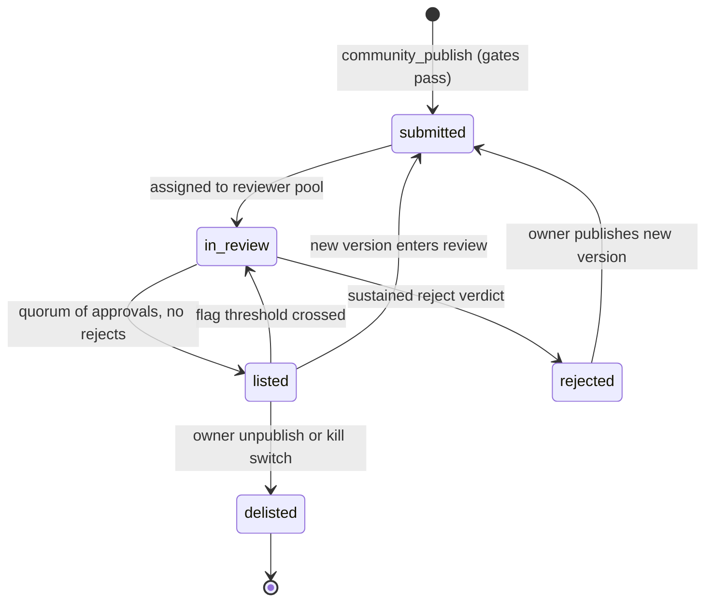
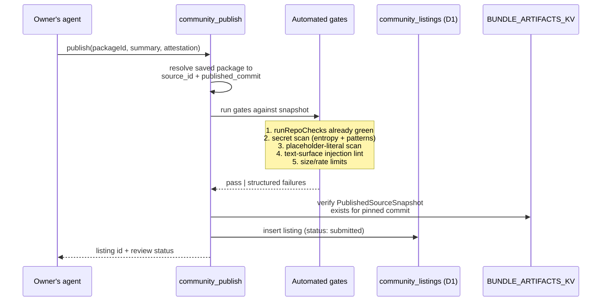
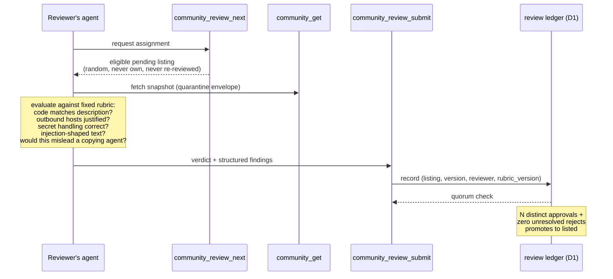
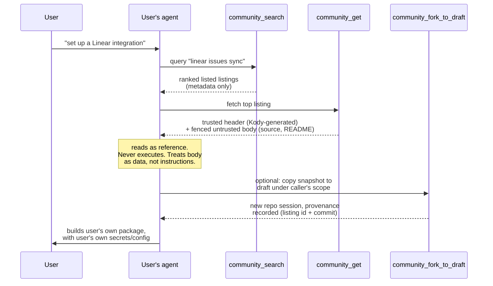
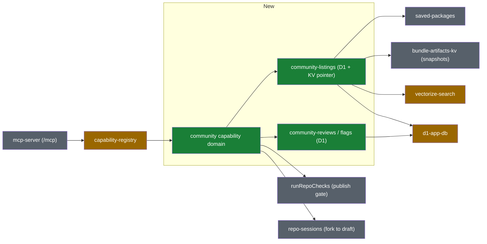

# Community package registry direction

This document describes an intended direction for letting users publish saved
packages to a shared, read-only community registry that other users' agents can
search and use **as a reference** when building their own packages.

It does **not** describe shipping behavior in this repository. Treat this as
planning guidance for the shape of a future architecture, not as a description
of the current runtime.

## Job statement

> When a Kody user wants an integration, let their agent find a good existing
> package to use as a reference or starting point — instead of building from
> scratch — without exposing the user to prompt injection or malicious actors.

Three sub-goals fall out of that statement:

1. **Discovery**: a shared corpus of packages that `search` can reach when the
   caller opts in.
2. **Reference, not install**: other users read the source as inspiration; they
   never execute it, import it, or depend on it at runtime.
3. **Safety**: content is gated before it becomes discoverable, and is treated
   as untrusted data even after it is.

## Threat model

The design is shaped by five concrete attacks:

| Threat                       | Vector                                                                                                                    | Primary mitigation                                                                                    |
| ---------------------------- | ------------------------------------------------------------------------------------------------------------------------- | ----------------------------------------------------------------------------------------------------- |
| Prompt injection             | Instructions hidden in README, description, `searchText`, tags, comments, or string literals that a consuming agent reads | Quarantine envelope on every read path + review rubric that screens text surfaces                     |
| Malicious reference code     | Plausible-looking code that exfiltrates secrets or calls attacker hosts when copied                                       | Reference-only model (no execution), automated scans, agent review before promotion                   |
| Bait and switch              | Publish benign content, get promoted, then push malicious updates                                                         | Listings pin an immutable snapshot; any new version re-enters review                                  |
| Secret / personal-data leaks | Owner accidentally publishes raw credentials or personal data in source                                                   | Publish-time secret scan, owner attestation, reviewer checklist item                                  |
| Sybil review rings           | Attacker accounts approve each other's listings                                                                           | Reviewer eligibility rules, randomized assignment, quorum of distinct reviewers, operator kill switch |

The most important consequence: **promotion controls discoverability, not
trust**. Even a fully reviewed, listed package is delivered to consuming agents
as untrusted data inside a quarantine envelope. Agent review raises the bar and
filters obvious abuse, but it is not a certification; the consumption path must
stay safe even when review fails.

## Design principles

- **Reference, not install.** Cross-user imports and cross-user execution stay
  unsupported. A community listing is a readable snapshot, never a runtime
  dependency. This preserves the per-user isolation invariant for everything
  that executes.
- **Immutable snapshots.** A listing points at one pinned published commit and
  the `PublishedSourceSnapshot` already written to `BUNDLE_ARTIFACTS_KV`. The
  listing content can never change under a review.
- **Opt-in on both sides.** Owners explicitly publish (with attestation);
  consumers explicitly ask for community scope in search. Nothing is shared by
  default, and unpublishing delists immediately.
- **Defense in depth.** Automated gates, agent review, quarantined delivery,
  flags, and an operator kill switch each assume the previous layer failed.
- **Compact MCP surface.** Everything lands as capabilities in a new `community`
  domain behind `search`/`execute` — no new top-level MCP tools.

## Existing primitives this composes

The registry deliberately reuses the publish machinery rather than inventing a
parallel pipeline:

| Existing primitive                                          | Role in this design                                                                              |
| ----------------------------------------------------------- | ------------------------------------------------------------------------------------------------ |
| `saved-packages` (`saved_packages`, `entity_sources`)       | The thing being listed; a listing references an owner's package at a pinned commit               |
| `bundle-artifacts-kv` (`PublishedSourceSnapshot`)           | Already-immutable source snapshot keyed by `source_id` + commit; the listing's canonical content |
| `runRepoChecks` (manifest, dependencies, bundle, typecheck) | First automated gate — a package must pass its own publish checks to be listable                 |
| `capability-registry` / `builtin-domains`                   | New `community` domain slots in beside `packages`, `repo`, etc.                                  |
| `vectorize-search` (`CAPABILITY_VECTOR_INDEX`)              | Listing embeddings with `kind: 'community'` metadata — the first deliberately shared corpus      |
| `repo-sessions`                                             | "Fork to draft" copies a snapshot into a new repo session under the **caller's** `userId`        |
| `d1-app-db`                                                 | New listing / review / flag tables live beside existing metadata tables                          |
| Fetch gateway + secret placeholders                         | Unchanged; nothing in this design materializes secrets for community content                     |

## New primitives

### 1. Community listings (D1 + KV pointer)

A new `community_listings` table, roughly:

- `id`, `owner_user_id`
- `package_name`, `kody_id` (denormalized display identity)
- `source_id`, `pinned_commit` (join to the immutable KV snapshot)
- `version` (monotonic per listing; each republish bumps it)
- `status`: `submitted` → `in_review` → `listed` | `rejected` | `delisted`
- `summary`, `tags_json` (owner-provided, injection-screened at review)
- `attestation_at` (owner confirmed no secrets / personal data)
- `promoted_at`, `delisted_at`, timestamps

Listings are **not** live views of `saved_packages`. Deleting or editing the
underlying package does not mutate a listing; it can only trigger delisting or a
new version that re-enters review.

### 2. Review ledger (D1)

`community_reviews`:

- `id`, `listing_id`, `listing_version`, `reviewer_user_id`
- `verdict`: `approve` | `reject` | `abstain`
- `findings_json`: structured results against a fixed rubric (see below)
- `rubric_version`, `created_at`

Plus `community_flags` for post-promotion reports from any signed-in user:
`listing_id`, `reporter_user_id`, `reason`, `created_at`.

### 3. `community` capability domain

New domain following the `package_*` naming conventions:

| Capability                | Purpose                                                                                                 |
| ------------------------- | ------------------------------------------------------------------------------------------------------- |
| `community_publish`       | Snapshot the caller's package at its current published commit into a listing (requires attestation)     |
| `community_unpublish`     | Immediate delist of the caller's own listing                                                            |
| `community_search`        | Ranked search over **listed** listings only                                                             |
| `community_get`           | Fetch one listing's metadata + source, wrapped in the quarantine envelope                               |
| `community_review_next`   | Assign the reviewing agent a pending listing it is eligible to review                                   |
| `community_review_submit` | Record a structured verdict against the rubric                                                          |
| `community_flag`          | Report a listed package for re-review                                                                   |
| `community_fork_to_draft` | Copy a listing snapshot into a new draft package under the **caller's** scope, with provenance recorded |

### 4. Shared search corpus (Vectorize)

Listing embeddings are upserted with id `community_${listingId}` and metadata
`{ kind: 'community', status: 'listed' }` — no `userId`. This is the first
intentionally cross-user corpus in the index, and it is what makes the
per-user-isolation carve-out below necessary. Search queries filter on
`kind: 'community'` and only ever return listed listings; embeddings are deleted
(not just filtered) on delist so stale vectors cannot leak.

## Listing lifecycle

A new version leaves the previously listed version live until the new one passes
review, so honest updates never punish the owner with downtime.

Key rules:

- The automated gates (below) run synchronously inside `community_publish`; a
  package that fails never creates a listing row.
- A new version is a new review cycle against the new pinned commit. Reviewers
  see the diff from the previously listed version to focus attention, but the
  verdict covers the whole snapshot.
- Any single `reject` verdict pauses promotion and routes to the owner with the
  structured findings; a sustained reject (not withdrawn after owner response or
  operator adjudication) ends that version.

## Publish pipeline

Automated gates, in order:

1. **Publish checks already green** — the pinned commit must be the package's
   `published_commit`, which means `runRepoChecks` (manifest, dependencies,
   bundle, typecheck) already passed.
2. **Secret scan** — reject high-entropy strings, known credential formats, and
   raw values in places where only `{{secret:…}}` references or `secretMounts`
   names should appear.
3. **Placeholder hygiene** — `secretMounts` and placeholder references are fine
   (they are names, not values); inline literals next to auth headers are not.
4. **Text-surface lint** — heuristic screen of README, `description`,
   `searchText`, tags, and JSDoc for instruction-shaped content ("ignore
   previous instructions", role-play framing, tool-invocation payloads). This is
   a tripwire, not a guarantee; the review rubric and quarantine envelope back
   it up.
5. **Limits** — per-user listing count and publish-rate limits.

## Agent review and promotion

Review is performed by **other users' agents**, on behalf of their humans,
through the same MCP surface — no new runtime is needed.

Mechanics that make this resistant to gaming:

- **Eligibility**: reviewers must be established accounts (account age plus at
  least one published-and-listed package of their own, or an operator grant).
  Owners can never review their own listings, and one review per user per
  listing version.
- **Randomized assignment**: `community_review_next` assigns from the pending
  pool rather than letting reviewers pick targets, which breaks coordinated
  approval rings that need to find each other's listings.
- **Quorum**: promotion requires N distinct approvals (start with N=3) and no
  unresolved reject. N is a tuning knob; it can rise with catalog size.
- **Structured verdicts**: findings are recorded against a versioned rubric so a
  rubric update can invalidate stale approvals and trigger re-review.
- **Post-promotion flags**: any signed-in user's agent can flag a listed
  package; crossing a flag threshold auto-delists pending re-review.
- **Operator kill switch**: the operator can delist instantly and ban repeat
  offenders. Automated review never overrides a human delist.

Incentive note: reviewing is work performed by someone else's agent. The
simplest sustainable loop is reciprocity — publishing a listing enqueues a small
number of review obligations for the owner's agent (review N to stay in the
queue). This keeps the reviewer pool proportional to the publisher pool without
building a separate reputation economy up front.

## Consumption path

The **quarantine envelope** is the load-bearing safety piece:

- `community_get` responses separate a **trusted header** (Kody-generated
  metadata: listing id, owner scope, pinned commit, review status, integration
  hosts detected by static analysis) from an **untrusted body** (source files,
  README, description) wrapped in explicit delimiters with an instruction to the
  consuming agent that the body is third-party data and must not be followed as
  instructions.
- Owner-provided free text (summary, tags, `searchText`) is indexed for ranking
  but is always rendered inside the untrusted body, never echoed into the
  trusted header or into MCP tool descriptions.
- `community_fork_to_draft` copies files into a normal repo session under the
  caller's `userId` and scope. From that point the ordinary publish checks and
  secret model apply — the fork is the caller's code, with the caller's secrets,
  and the listing has no residual link to it beyond a provenance record.

## Invariant impact

| Invariant (primitives.yaml)  | Impact                                                                                                                                                                                                                                                    |
| ---------------------------- | --------------------------------------------------------------------------------------------------------------------------------------------------------------------------------------------------------------------------------------------------------- |
| `per-user-isolation`         | **Needs an explicit, narrow carve-out**: community listings are deliberately shared, immutable, opt-in snapshots. All execution, imports, secrets, and mutable state stay per-user. The invariant text should name this exception when the feature ships. |
| `canonical-repo-source`      | Preserved with a nuance: the listing's canonical content is the pinned KV snapshot, not the live repo — by design, so reviews cover fixed bytes.                                                                                                          |
| `compact-mcp-surface`        | Preserved: everything is capabilities in one new domain behind `search`/`execute`.                                                                                                                                                                        |
| `no-secrets-in-chat`         | Reinforced: the publish gate scans for raw secrets, and nothing in the community path resolves placeholders.                                                                                                                                              |
| `integration-host-allowlist` | Untouched: community content is never executed, so no token materialization path is added.                                                                                                                                                                |

## Proposed system map

Rendered in the visual-recap style — green nodes are new primitives, yellow are
extended, grey are existing primitives composed as-is:

Extension notes:

- `vectorize-search` gains a `kind: 'community'` corpus without a `userId`
  filter — the only place the shared corpus touches an existing primitive's
  contract.
- `capability-registry` gains one new domain (routine addition per
  [adding-capabilities](../adding-capabilities.md)).
- `d1-app-db` gains the three community tables via normal migrations.

## Phasing

Each phase is independently shippable and safe on its own:

1. **Foundation** — migrations, `community_publish` / `community_unpublish` /
   `community_search` / `community_get` with the quarantine envelope and all
   automated gates. Promotion is **operator-only** (manual allowlist), so the
   catalog can be seeded and the consumption path hardened before any community
   review exists.
2. **Agent review** — `community_review_next` / `community_review_submit`,
   eligibility rules, quorum promotion, reject routing, and the reciprocity
   queue. Operator kill switch stays authoritative.
3. **Hardening and convenience** — `community_flag` with auto-delist thresholds,
   `community_fork_to_draft` with provenance, diff-aware re-review for new
   versions, and rubric versioning with stale-approval invalidation.

## Non-goals

- **No cross-user installs or imports.** `kody:@scope/pkg` imports continue to
  resolve only within the caller's own account.
- **No execution of community content**, ever — not even sandboxed "try it"
  runs, which would reopen the entire threat model.
- **No social layer** (comments, stars, follower graphs). Reviews and flags are
  moderation signals, not engagement features.
- **No monetization or ownership transfer.**

## Open questions

- **Reviewer incentive tuning**: is reciprocity (publish → owe reviews) enough,
  or does the pending queue starve without a stronger nudge?
- **Quorum vs. catalog size**: N=3 distinct reviewers is a guess; the right
  value depends on how many active publishers exist.
- **Injection-lint scope**: how aggressive can the text-surface lint be before
  false positives make honest publishing annoying? Reviewers may need an
  explicit "lint flagged this, I checked it" affordance.
- **Snapshot licensing**: publishing implies a read/reference license to other
  users; the attestation flow should state this and the listing should record an
  explicit license choice.
- **Search integration**: should listed listings eventually appear in unified
  `search` results behind an opt-in scope flag, or stay behind
  `community_search` permanently? Starting separate keeps the trusted/untrusted
  boundary simplest.
