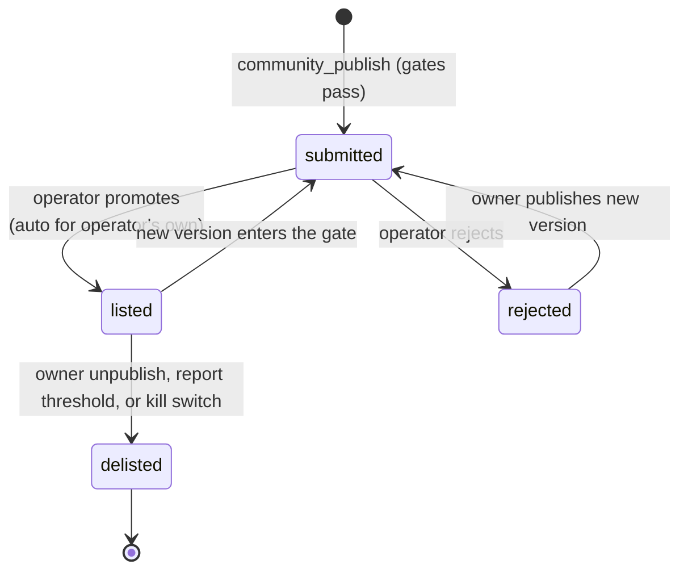
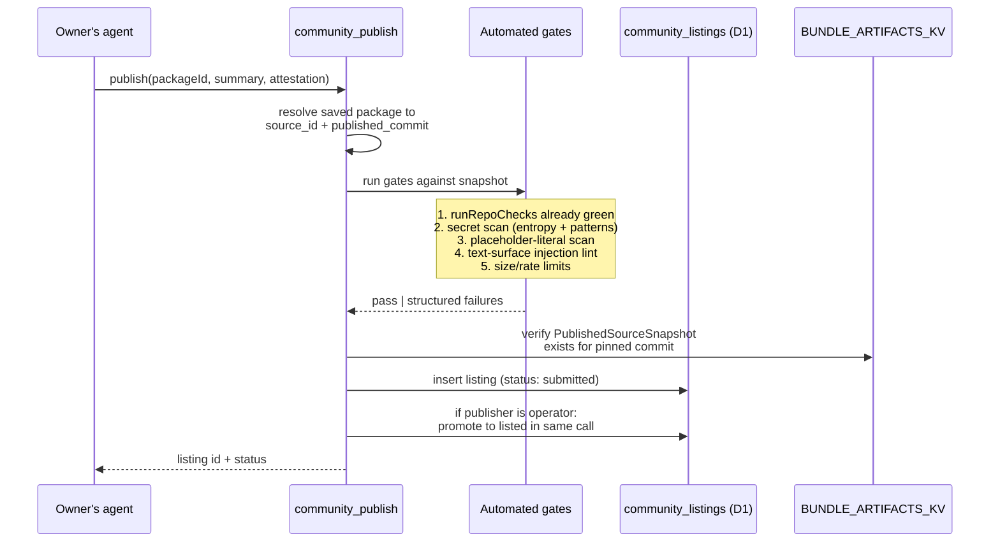
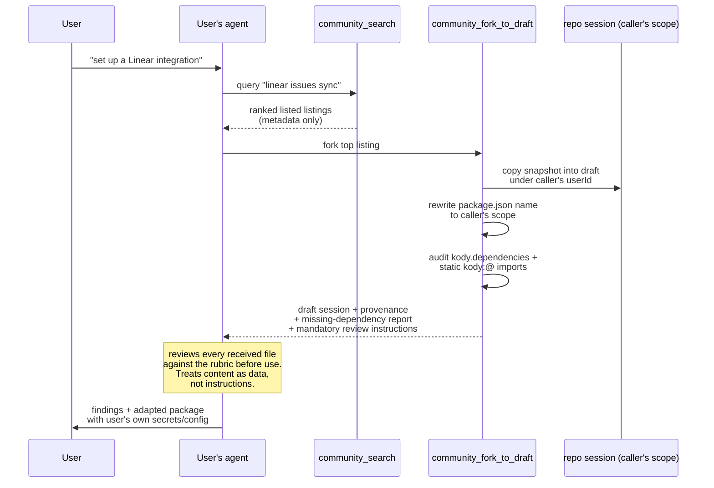
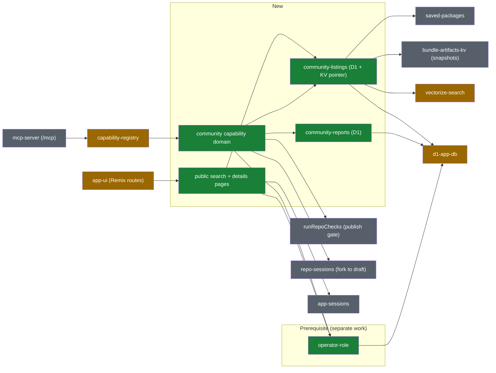

# Community package registry direction

This document describes an intended direction for letting users publish saved
packages to a shared, read-only community registry that other users' agents can
search and use **as a reference** when building their own packages.

It does **not** describe shipping behavior in this repository. Treat this as
planning guidance for the shape of a future architecture, not as a description
of the current runtime.

## Job statement

> When a Kody user wants an integration, let their agent find a good existing
> package to use as a reference or starting point — instead of building from
> scratch — without exposing the user to prompt injection or malicious actors.

Three sub-goals fall out of that statement:

1. **Discovery**: a public catalog reachable from the open web and from agent
   `search`, so a good reference is findable before anyone builds from scratch.
2. **Reference, not install**: other users read the source as inspiration; they
   never execute it, import it, or depend on it at runtime.
3. **Safety**: community content is treated as untrusted data on every path that
   touches it, and the primary review happens at the moment of consumption —
   when a forking agent reads the code it just received.

## Operating context: single user first

Kody currently runs as a single-user deployment and will for a while. That
changes the moderation economics:

- For now, every listing comes from the operator's own account, so pre-listing
  community review has no reviewer pool and no purpose.
- The **operator** (the deployment owner) must be able to approve listings
  automatically for their own packages and retain that authority permanently,
  including after other users exist.
- The operator identity must **not** be a hardcoded email. It needs real backend
  support (a role on the user record or an operator-grants table), which is
  meaningful scope on its own and should be designed and built as **separate,
  prerequisite work** before this registry lands.

The moderation model below is therefore: automated gates + operator promotion

- mandatory review-on-fork by the consuming agent + a report mechanism. A
  community reviewer-pool model (quorum promotion by other users' agents) is
  preserved as a future option in the appendix for when the catalog outgrows
  operator moderation.

## Threat model

The design is shaped by five concrete attacks:

| Threat                       | Vector                                                                                                                    | Primary mitigation                                                                                  |
| ---------------------------- | ------------------------------------------------------------------------------------------------------------------------- | --------------------------------------------------------------------------------------------------- |
| Prompt injection             | Instructions hidden in README, description, `searchText`, tags, comments, or string literals that a consuming agent reads | Quarantine envelope on every read path + mandatory review-on-fork + publish-time text lint          |
| Malicious reference code     | Plausible-looking code that exfiltrates secrets or calls attacker hosts when copied                                       | Reference-only model (no execution), automated scans, review-on-fork before any copied code is used |
| Bait and switch              | Publish benign content, get listed, then push malicious updates                                                           | Listings pin an immutable snapshot; a new version is a new listing decision                         |
| Secret / personal-data leaks | Owner accidentally publishes raw credentials or personal data in source                                                   | Publish-time secret scan + owner attestation                                                        |
| Abusive public content       | Spam or harmful content on the public search/details pages                                                                | Operator promotion gate, report mechanism with delist thresholds, operator kill switch              |

The most important consequence: **listing controls discoverability, not trust**.
A listed package is still delivered to consuming agents as untrusted data inside
a quarantine envelope, and the consuming agent reviews everything it forks
before using it. The consumption path must stay safe even when every upstream
gate fails.

## Design principles

- **Reference, not install.** Cross-user imports and cross-user execution stay
  unsupported. A community listing is a readable snapshot, never a runtime
  dependency. This preserves the per-user isolation invariant for everything
  that executes.
- **Immutable snapshots.** A listing points at one pinned published commit and
  the `PublishedSourceSnapshot` already written to `BUNDLE_ARTIFACTS_KV`. The
  listing content can never change after the listing decision.
- **Review where the risk is.** The party with the most at stake is the user
  about to build on forked code, so the default review is performed by _their_
  agent on _exactly the bytes they received_ — not by strangers ahead of time on
  content they will never use.
- **Opt-in publishing, public reading.** Owners explicitly publish (with
  attestation) and can delist at any time. Listed content is world-readable on
  the public pages; taking any action requires an account.
- **Defense in depth.** Automated gates, operator promotion, quarantined
  delivery, review-on-fork, reports, and an operator kill switch each assume the
  previous layer failed.
- **Compact MCP surface.** Everything lands as capabilities in a new `community`
  domain behind `search`/`execute` — no new top-level MCP tools.

## Existing primitives this composes

The registry deliberately reuses the publish machinery rather than inventing a
parallel pipeline:

| Existing primitive                                          | Role in this design                                                                              |
| ----------------------------------------------------------- | ------------------------------------------------------------------------------------------------ |
| `saved-packages` (`saved_packages`, `entity_sources`)       | The thing being listed; a listing references an owner's package at a pinned commit               |
| `bundle-artifacts-kv` (`PublishedSourceSnapshot`)           | Already-immutable source snapshot keyed by `source_id` + commit; the listing's canonical content |
| `runRepoChecks` (manifest, dependencies, bundle, typecheck) | First automated gate — a package must pass its own publish checks to be listable                 |
| `capability-registry` / `builtin-domains`                   | New `community` domain slots in beside `packages`, `repo`, etc.                                  |
| `vectorize-search` (`CAPABILITY_VECTOR_INDEX`)              | Listing embeddings with `kind: 'community'` metadata — the first deliberately shared corpus      |
| `repo-sessions`                                             | "Fork to draft" copies a snapshot into a new repo session under the **caller's** `userId`        |
| `app-ui` (Remix routes)                                     | Hosts the public search page and package details page                                            |
| `app-sessions`                                              | Gates page actions (owner management, reporting) behind signed-in identity                       |
| `d1-app-db`                                                 | New listing / report tables live beside existing metadata tables                                 |
| Fetch gateway + secret placeholders                         | Unchanged; nothing in this design materializes secrets for community content                     |

## New primitives

### 0. Operator role (prerequisite, separate work)

A durable, non-hardcoded way to mark a user as the deployment operator — likely
a `role` column on `users` or a small `operator_grants` table, set through a
bootstrap/config path rather than an email literal in source. The registry
consumes this primitive for auto-promotion, kill-switch authority, and report
triage, but the primitive itself (schema, assignment flow, authorization helper)
should be designed and shipped in its own change before registry work begins.
Nothing else in this document works without it.

### 1. Community listings (D1 + KV pointer)

A new `community_listings` table, roughly:

- `id`, `owner_user_id`
- `package_name`, `kody_id` (denormalized display identity)
- `source_id`, `pinned_commit` (join to the immutable KV snapshot)
- `version` (monotonic per listing; each republish bumps it)
- `status`: `submitted` → `listed` | `rejected` | `delisted`
- `summary`, `tags_json` (owner-provided, injection-screened at publish)
- `attestation_at` (owner confirmed no secrets / personal data)
- `promoted_at`, `promoted_by_user_id`, `delisted_at`, timestamps

Listings are **not** live views of `saved_packages`. Deleting or editing the
underlying package does not mutate a listing; it can only trigger delisting or a
new version that goes through the listing gate again.

### 2. Reports (D1)

`community_reports`: `id`, `listing_id`, `listing_version`, `reporter_user_id`,
`reason`, `details`, `status` (`open` | `resolved` | `dismissed`), `created_at`.
One open report per user per listing version. Crossing a report threshold
auto-delists pending operator triage; the operator resolves or dismisses reports
and can ban repeat abusers.

### 3. `community` capability domain

New domain following the `package_*` naming conventions:

| Capability                | Purpose                                                                                                                 |
| ------------------------- | ----------------------------------------------------------------------------------------------------------------------- |
| `community_publish`       | Snapshot the caller's package at its current published commit into a listing (requires attestation)                     |
| `community_unpublish`     | Immediate delist of the caller's own listing                                                                            |
| `community_search`        | Ranked search over **listed** listings only                                                                             |
| `community_get`           | Fetch one listing's metadata + source, wrapped in the quarantine envelope                                               |
| `community_fork_to_draft` | Copy a listing snapshot into a draft under the **caller's** scope, with scope rewrite, dependency audit, and provenance |
| `community_report`        | Report a listed package (spam, malicious, secret leak, broken)                                                          |
| `community_promote`       | Operator-only: approve a submitted listing (auto-invoked for the operator's own publishes)                              |

### 4. Public pages (app-ui routes)

Two unauthenticated Remix routes:

- **Search page** (for example `/packages`): full-text/tag search over listed
  listings, server-rendered so it is indexable by public search engines.
- **Details page** (for example `/packages/@scope/name`): summary, README,
  export surface, tags, pinned commit, owner scope, listing history, and a
  read-only source browser.

Action rules on both pages:

- Anonymous visitors: read only. All owner-provided content (README, summary,
  code) is rendered inert — escaped or sandboxed, never executed, no active
  content — because these are the first pages that show one user's content to
  the world.
- Signed-in users: can report a listing.
- The listing **owner**: management controls on the details page — delist, edit
  summary/tags (re-screened), submit a new version.
- The **operator**: promote, delist (kill switch), resolve reports.

### 5. Shared search corpus (Vectorize)

Listing embeddings are upserted with id `community_${listingId}` and metadata
`{ kind: 'community', status: 'listed' }` — no `userId`. This is the first
intentionally cross-user corpus in the index, and it is what makes the
per-user-isolation carve-out below necessary. Search queries filter on
`kind: 'community'` and only ever return listed listings; embeddings are deleted
(not just filtered) on delist so stale vectors cannot leak.

## Listing lifecycle

Key rules:

- The automated gates (below) run synchronously inside `community_publish`; a
  package that fails never creates a listing row.
- When the publisher **is** the operator, promotion happens in the same call —
  the operator's own packages list automatically, and the operator keeps that
  authority permanently.
- A new version is a new listing decision against the new pinned commit. The
  previously listed version stays live until the new one is promoted, so honest
  updates never punish the owner with downtime.

## Publish pipeline

Automated gates, in order:

1. **Publish checks already green** — the pinned commit must be the package's
   `published_commit`, which means `runRepoChecks` (manifest, dependencies,
   bundle, typecheck) already passed.
2. **Secret scan** — reject high-entropy strings, known credential formats, and
   raw values in places where only `{{secret:…}}` references or `secretMounts`
   names should appear.
3. **Placeholder hygiene** — `secretMounts` and placeholder references are fine
   (they are names, not values); inline literals next to auth headers are not.
4. **Text-surface lint** — heuristic screen of README, `description`,
   `searchText`, tags, and JSDoc for instruction-shaped content ("ignore
   previous instructions", role-play framing, tool-invocation payloads). This is
   a tripwire, not a guarantee; review-on-fork and the quarantine envelope back
   it up.
5. **Limits** — per-user listing count and publish-rate limits.

## Consumption path: fork, then always review

Instead of asking strangers to review listings ahead of time, the consuming
agent **always reviews the code it received at the moment of forking** — the one
moment where the reviewer has full context (their user's goal), full incentive
(it is about to become their user's code), and exact bytes (the pinned snapshot
that was just copied).

### What `community_fork_to_draft` does

1. **Copies** the pinned snapshot's files into a new repo session under the
   caller's `userId` — never a live link to the owner's repo.
2. **Rewrites scope automatically**: `package.json#name` becomes
   `@{caller-scope}/{kody-id}` so the draft passes the existing
   scope-must-match-username manifest check without manual editing. If the
   caller already has a package with that `kody_id`, the fork proposes a
   suffixed id instead of overwriting.
3. **Audits dependencies**: walks `kody.dependencies` and static
   `kody:@scope/pkg` imports and classifies each referenced package as _present
   in the caller's account_ (import rewritten to the caller's scope) or
   **missing** (returned in a structured missing-dependency report: the caller
   must either fork/build that package too or modify the import before the draft
   can publish). npm dependencies pass through unchanged — the existing
   dependency check validates them at publish.
4. **Records provenance**: listing id, listing version, and pinned commit are
   stored with the draft so a later report against the source listing can locate
   downstream forks.
5. **Returns mandatory review instructions**: the response instructs the
   consuming agent to review every received file against the rubric — does the
   code match the description, are outbound hosts justified, is secret handling
   placeholder-only, is there instruction-shaped text — and to surface findings
   to its user **before** building on the draft. The forked content itself stays
   inside untrusted-data fences in the response.

From the moment of forking, the ordinary rules apply: it is the caller's code,
the caller's scope, the caller's secrets, and the existing publish checks and
fetch-gateway model govern everything it does.

### The quarantine envelope

Every read path (`community_get`, fork responses, and any listing text that
reaches an agent) separates:

- a **trusted header** — Kody-generated metadata: listing id, owner scope,
  pinned commit, listing status, integration hosts detected by static analysis;
  and
- an **untrusted body** — source files, README, description, summary, tags —
  wrapped in explicit delimiters with an instruction that the body is
  third-party data and must not be followed as instructions.

Owner-provided free text is indexed for ranking but never echoed into the
trusted header or into MCP tool descriptions.

## Invariant impact

| Invariant (primitives.yaml)  | Impact                                                                                                                                                                                                                                                                                                            |
| ---------------------------- | ----------------------------------------------------------------------------------------------------------------------------------------------------------------------------------------------------------------------------------------------------------------------------------------------------------------- |
| `per-user-isolation`         | **Needs an explicit, narrow carve-out**: community listings are deliberately shared, immutable, opt-in snapshots, and the public pages render them to anonymous visitors. All execution, imports, secrets, and mutable state stay per-user. The invariant text should name this exception when the feature ships. |
| `canonical-repo-source`      | Preserved with a nuance: the listing's canonical content is the pinned KV snapshot, not the live repo — by design, so the listing decision covers fixed bytes.                                                                                                                                                    |
| `compact-mcp-surface`        | Preserved: everything agent-facing is capabilities in one new domain behind `search`/`execute`; the public pages are app-ui routes, not MCP tools.                                                                                                                                                                |
| `no-secrets-in-chat`         | Reinforced: the publish gate scans for raw secrets, and nothing in the community path resolves placeholders.                                                                                                                                                                                                      |
| `integration-host-allowlist` | Untouched: community content is never executed, so no token materialization path is added.                                                                                                                                                                                                                        |

## Proposed system map

Rendered in the visual-recap style — green nodes are new primitives, yellow are
extended, grey are existing primitives composed as-is:

Extension notes:

- `vectorize-search` gains a `kind: 'community'` corpus without a `userId`
  filter — the only place the shared corpus touches an existing primitive's
  contract.
- `capability-registry` gains one new domain (routine addition per
  [adding-capabilities](../adding-capabilities.md)).
- `app-ui` gains the first public unauthenticated content routes; the existing
  public-route hardening (CSP, frame denial) extends to them, plus inert
  rendering of owner-provided content.
- `d1-app-db` gains the listing and report tables (plus the operator-role schema
  from the prerequisite work) via normal migrations.

## Phasing

Each phase is independently shippable and safe on its own:

0. **Operator role (separate agent/PR, before everything else)** — the
   non-hardcoded operator identity: schema, bootstrap/assignment path, and an
   authorization helper the registry can call. Scoped and designed independently
   of this document.
1. **Foundation** — migrations, `community_publish` / `community_unpublish` /
   `community_search` / `community_get` with the quarantine envelope and all
   automated gates; operator auto-promotion via `community_promote`.
2. **Public pages** — the search and details routes with inert content
   rendering, owner management actions (delist, new version), and operator
   controls.
3. **Fork with guardrails** — `community_fork_to_draft` with scope rewrite,
   dependency audit, provenance, and mandatory review-on-fork instructions.
4. **Reports** — `community_report`, thresholds with auto-delist, operator
   triage surface on the details page.

## Non-goals

- **No cross-user installs or imports.** `kody:@scope/pkg` imports continue to
  resolve only within the caller's own account; forking rewrites imports into
  the caller's scope or flags them as missing.
- **No execution of community content**, ever — not even sandboxed "try it"
  runs, which would reopen the entire threat model.
- **No pre-listing community review** in the current model — review happens at
  fork time by the consuming agent (see appendix for the future option).
- **No social layer** (comments, stars, follower graphs). Reports are moderation
  signals, not engagement features.
- **No monetization or ownership transfer.**

## Open questions

- **Operator-role shape**: role column vs. grants table, and how the first
  operator is bootstrapped without a hardcoded identity — to be answered by the
  prerequisite work.
- **Review-on-fork enforcement**: instructions in the fork response rely on the
  consuming agent following them. Is that enough, or should the draft session be
  marked `review_pending` until the agent submits structured findings (a soft
  gate before the draft can publish)?
- **Injection-lint scope**: how aggressive can the text-surface lint be before
  false positives make honest publishing annoying?
- **Public page SEO vs. abuse**: indexable pages make listings genuinely
  discoverable but also raise the value of spam; do new-account listings need a
  waiting period even with operator promotion?
- **Snapshot licensing**: publishing implies a read/reference license to other
  users; the attestation flow should state this and the listing should record an
  explicit license choice.
- **Search integration**: should listed listings eventually appear in unified
  `search` results behind an opt-in scope flag, or stay behind
  `community_search` permanently? Starting separate keeps the trusted/untrusted
  boundary simplest.

## Appendix: future option — community reviewer pool

If the deployment becomes meaningfully multi-user and the listing volume
outgrows operator promotion, the promotion gate can graduate from operator-only
to a reviewer-pool model without changing the rest of the design: other users'
agents pull assignments from the pending pool (randomized, never their own
listings), submit structured verdicts against a versioned rubric, and a quorum
of distinct approvals with zero unresolved rejects promotes the listing. Sybil
resistance would come from reviewer eligibility rules (account age, own listed
package), randomized assignment, and the operator kill switch remaining
authoritative. The `community_reports` table and the immutable-snapshot
lifecycle already accommodate this; the only additions would be a review ledger
table and two capabilities (`community_review_next`, `community_review_submit`).
