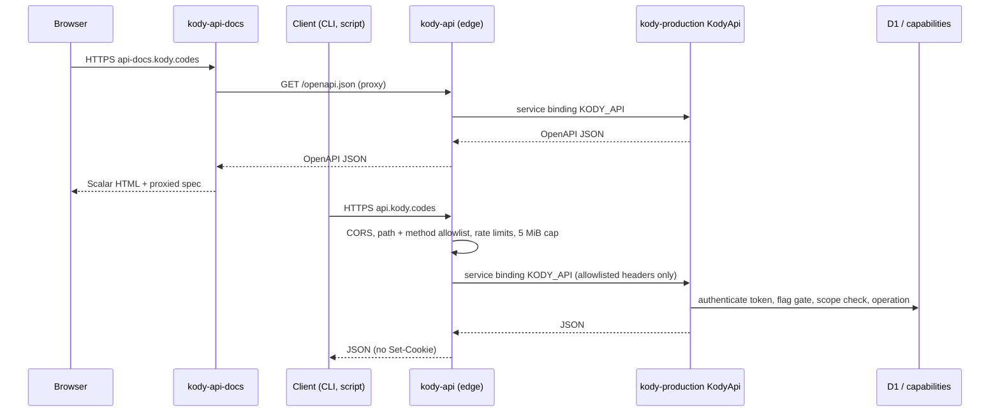

# Open API

The Kody Open API is the public HTTP surface at `https://api.kody.codes`. It
serves JSON only: `GET /openapi.json` (OpenAPI 3.1) and the versioned `/v1`
operations. Interactive HTML docs live on a separate Worker at
`https://api-docs.kody.codes` (Scalar). The same operations back the flag-gated
MCP `api` tool, and two of them form the CapabilityProxy that local execute
(`@kodycodes/cli`) calls.

The HTTP API itself is not feature-flagged. The MCP `api` tool (`mcp-api-tool`)
and the CapabilityProxy (`local-execute`) are; see
[feature flags](./feature-flags.md).

## Workers

- `kody-api` (`packages/api-worker/`) is a thin edge script on the
  `api.kody.codes` custom domain. It answers `/health` itself, allows only `/`,
  `/openapi.json`, and `/v1/*`, applies per-IP (`API_IP_RATE_LIMITER`, 600/min)
  and per-token (`API_TOKEN_RATE_LIMITER`, 300/min, keyed by token id, never the
  secret) limits, caps buffered bodies at 5 MiB (413), and forwards only
  `Authorization`, `Content-Type`, `Accept`, `User-Agent`, and
  `CF-Connecting-IP`. `Cookie` and `X-Kody-*` never reach origin, and origin
  `Set-Cookie` never reaches the client. CORS allows any origin because auth is
  bearer-only. It never serves HTML.
- `kody-api-docs` (`packages/api-docs-worker/`) is the interactive docs host on
  `api-docs.kody.codes`. It serves a Scalar shell at `/`, proxies
  `/openapi.json` from the live API, and answers `/health`. DNS and the
  certificate come from `custom_domain: true` on deploy (same as
  `api.kody.codes`).
- Origin exports `KodyApi` (`packages/worker/src/open-api/kody-api.ts`), a
  `WorkerEntrypoint` that lazy-loads the handler so the origin startup budget
  does not pay for it. Operations run on origin so they share the capability
  registry, D1, and account gates with MCP. The Remix UI does not call the Open
  API; both use the same domain modules. The OpenAPI document's `externalDocs`
  points at `https://api-docs.kody.codes`.
- Custom domains create their own DNS record and certificate on deploy, so
  `api.kody.codes` and `api-docs.kody.codes` need no manual DNS step as long as
  no conflicting record already exists in the `kody.codes` zone. Previews deploy
  `kody-pr-<n>-api` on `workers.dev`, bound to that preview's origin. API docs
  are production-only (they always proxy the live OpenAPI document).

## Operations

`packages/worker/src/open-api/operations.ts` is the route table and the source
of truth for `/openapi.json`. Most operations are registry capabilities
(`operationId` is the capability name and inputs are its schema; path params map
to same-named inputs, `GET`/`DELETE` read the query string, and other methods
read a JSON body). Token and CapabilityProxy operations are native.

`/v1` is additive: add operations freely; never rename an `operationId`, change
a method or path, or remove an operation without a new version.

Never in the Open API: `execute`, secret plaintext, the inbound webhook receive
path, package-app HTTP/WebSocket/realtime traffic, admin capabilities, and
runtime-only capabilities (values, invocation tokens, package-app fetch,
synthetic dispatch).

Plain API reads and token mints need no execute entitlement and never start a
Dynamic Worker. Writes hold the account write lease, like MCP tool calls.

## Tokens

Scoped API tokens (`kody_at_<id>_<secret>`) are the only HTTP credential. They
are a separate credential class from MCP OAuth
([ADR 0053](../decisions/0053-scoped-api-tokens-are-not-mcp-oauth-scopes.md)).
Kody stores only a SHA-256 hash; the value is returned once, on mint or rotate.

- Scopes: `<resource>:read` and `<resource>:write` for `account`, `memories`,
  `secrets`, `packages`, `repos`, `jobs`, `webhooks`, `email`, `integrations`,
  `mcp-servers`, `runs`, `storage`, `community`, and `tokens`; plus
  `search:read` and `local-execute`. `:write` satisfies `:read`. Capabilities
  that sign, lock, or run caller queries (`secretLock`, `secretJwtSign`,
  `secretProviderLock`, `storageQuery`) need `:write`. `local-execute` grants
  the whole `kody.*` runtime surface, like cloud execute.
- TTL: tokens expire after `idle_ttl_seconds` without use (default 900, range
  60–3600). Each authenticated request slides `expires_at` forward (debounced to
  one write per minute), never past `max_expires_at` (default 24 hours, at most
  7 days).
- Minting: the first token comes from the MCP `api` tool (`tokenCreate`, full
  MCP grant). A token holding `tokens:write` can mint more, but only with scopes
  it holds and never outliving its own `max_expires_at`. The `local-execute`
  scope requires the `local-execute` flag. At most 50 active tokens per account.
- Mint and rotate return `token`, `token_type: "Bearer"`, `id`, `name`,
  `scopes`, `status`, `idle_ttl_seconds`, `expires_at`, `max_expires_at`, and
  timestamps. List and get never return the value.
- `GET /v1/tokens/current`, `POST /v1/tokens/current/rotate`, and
  `DELETE /v1/tokens/current` need no scope and act on the calling token.
- Account gates match `/mcp`: verified email, not suspended, not deleting, and
  the token must postdate the last password change.
- Redaction: `redactApiTokens` (`packages/shared/src/api-token-format.ts`) masks
  `kody_at_…` values in API error envelopes, MCP `api` tool failure logs, and
  execute results, logs, and errors (what run records and Activity store),
  whether or not the run has secrets. The MCP `api` tool does not write run
  records, and its success log carries no result.

## CapabilityProxy

The cloud half of local execute. The CLI runs the module in a local workerd and
forwards each `kody:runtime` call here. This contract matches
`@kodycodes/cli@1.4.0`
([kody-bot/cli#9](https://github.com/kody-bot/cli/pull/9)).

| Route                              | Body                              | 200 response                                                                    |
| ---------------------------------- | --------------------------------- | ------------------------------------------------------------------------------- |
| `GET /v1/capability-proxy/session` | none                              | `{ scopes, expiresAt, maxExpiresAt, idleTtlSeconds, user, limits }` (camelCase) |
| `POST /v1/capability-proxy/call`   | `{ path, args, conversationId? }` | `{ result }`                                                                    |

- `path` is the `kody:runtime` property path: `['kody', name]`,
  `['kody', 'mcp', server, tool]`, `['workflows', 'create']`, or
  `['packages', 'invoke']`. `args` are positional (at most 8; paths at most 8
  segments). Unknown keys answer 400.
- Calls dispatch through the same `kody.*` tool map as ad hoc cloud execute, so
  capability behavior, `kody.mcp`, workflows, and package invokes match the
  cloud. Caller errors from a capability keep their status and message.
  Unexpected capability failures return 500 `capability_error`, and their
  message hides `kody_at_` tokens and any secret values the call wrote. Platform
  failures outside the capability return the generic `internal_error`, and the
  details are logged server-side.
- Confused-deputy limits: the request is JSON arguments only. No caller header
  or cookie is forwarded into a capability, and the edge strips `Cookie` and
  `X-Kody-*` before origin sees the request.
- Order of checks: bearer token (401), then the `local-execute` flag (403
  `feature_disabled`, `details.feature_flag: "local-execute"`), then the
  `local-execute` scope (403 `insufficient_scope`). The flag runs first so the
  CLI can tell "not enabled for you" from "mint a token with the local-execute
  scope".
- Not proxied yet: outbound `fetch`, secret substitution in fetch headers, and
  `createAuthenticatedFetch`. The CLI fetches directly from workerd today.

## Errors

Every error is `{ error: { code, message, details? } }` with
`Cache-Control: no-store`.

| Status | `code`                                                                                       |
| ------ | -------------------------------------------------------------------------------------------- |
| 400    | `invalid_request`                                                                            |
| 401    | `unauthorized` (missing, invalid, expired, or revoked token)                                 |
| 403    | `insufficient_scope`, `feature_disabled`, `email_verification_required`, `account_suspended` |
| 404    | `not_found`, `feature_unavailable` (MCP `api` tool off)                                      |
| 405    | `method_not_allowed` (with `Allow`)                                                          |
| 409    | `account_deleting`                                                                           |
| 413    | `payload_too_large`                                                                          |
| 415    | `unsupported_media_type`                                                                     |
| 429    | `rate_limited` (edge, `Retry-After`), `entitlement_limit`                                    |
| 500    | `capability_error`, `internal_error`                                                         |

## Metering

Each operation records one observe-only `api_call`
([usage metering](./usage-metering.md)); CapabilityProxy hops use
`capability-proxy:<path>` as the entity id. The capability behind a call meters
itself as usual (email sends, outbound fetches, package runs). Local execute CPU
runs on the user's machine and is never recorded as `execute` or
`dynamic_worker_day`.

## MCP `api` tool

The third MCP tool beside `search` and `execute`, registered only when
`mcp-api-tool` is on (`packages/worker/src/mcp/tools/api.ts`). Input is
`{ operationId, params }` with `params` as one flat object (path, query, and
body fields together). It runs with the session's MCP grant, so token scopes do
not apply, but native feature-flag gates still do. The flag is re-checked on
every call, and a session that registered the tool before the flag turned off
gets `feature_unavailable`.
