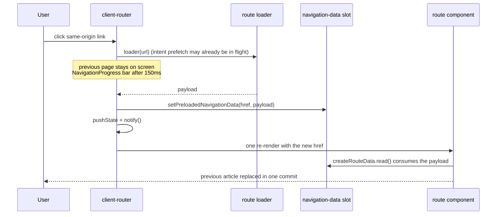

# No-flash navigation

Changing routes never clears the current page and never shows a loading state in
its place. The next page replaces the previous one in a single DOM commit,
already holding its data. This document describes the mechanism that makes that
the default and the one helper a route uses to stay on it.

## How a navigation works



1. `packages/worker/client/client-router.tsx` intercepts the click and runs the
   destination's loader from `clientRouteLoaders`
   (`packages/worker/client/routes/index.tsx`) **before** it touches the URL.
   Hover, focus, and touch start that loader early (`intent-prefetch.ts`), and
   the lazy route chunk is warmed alongside it (`lazy-route.tsx`).
2. While the loader runs, nothing about the page changes. The only pending UI is
   the 3px `NavigationProgress` bar, and only when the navigation is still
   pending after 150ms.
3. The loader result is parked in the single-slot navigation store
   (`navigation-data.ts`), the URL is committed, and the tree re-renders once.
4. The route's `createRouteData(...).read(handle, currentHref)` consumes that
   slot (or the SSR-embedded payload on the first document) and returns
   `kind: 'ready'` with the new payload. The previous content and the new
   content are never on screen together and no intermediate state exists.

Persistent shells (`/account`, `/admin`, `/docs`) additionally skip the page
view transition so their rail does not re-animate; `shouldUseViewTransition` in
`client-router.tsx` owns that list, and `prefers-reduced-motion` disables
transitions everywhere.

## Writing a route

Use `createRouteData` from `#client/route-data.tsx`. It owns consume-once of the
loader payload, the fallback fetch and its href latch, abort handling, and the
last-good payload the route keeps rendering while any fallback runs.

```tsx
import {
	createRouteData,
	renderRoutePendingStatus,
} from '#client/route-data.tsx'

export function ThingRoute(handle: Handle) {
	const thingData = createRouteData({
		key: 'thing', // AppLoaderData key returned by thingRouteLoader
		async load(href, signal) {
			const response = await fetch(apiHrefFor(href), { signal })
			if (response.status === 404) return null // -> kind: 'not-found'
			const payload = await readJson<ThingLoaderData>(response)
			if (!response.ok || !payload?.ok) throw new Error('Unable to load.') // -> 'error'
			return payload
		},
	})

	return () => {
		const currentHref = readCurrentRouterHref(handle)
		const snapshot = thingData.read(handle, currentHref)
		if (snapshot.kind === 'not-found') return <NotFound />
		if (snapshot.kind === 'error') return <LoadError />
		const thing = snapshot.data
		// Only the SPA cold path (no SSR payload, nothing loaded before) has
		// nothing to keep on screen.
		if (thing === null) return <p role="status">Loading…</p>
		const pending = snapshot.kind === 'pending'
		return (
			<article aria-busy={pending ? 'true' : undefined}>
				{pending ? renderRoutePendingStatus() : null}
				<h1>{thing.title}</h1>
			</article>
		)
	}
}
```

Snapshot meanings:

- `ready`: `data` describes the current location. This is every navigation on
  the happy path.
- `pending`: a fallback fetch for the current location is in flight. `data` is
  the last good payload — the previous page when `stale` is true — and the route
  keeps rendering it under `aria-busy` with the visually hidden
  `renderRoutePendingStatus()` live region so assistive tech hears the update
  without the layout moving. Fallback fetches happen when the router's loader
  failed, after a stale refresh (a form POST redirecting back to the same URL),
  or on a cold SPA mount without SSR data.
- `not-found` / `error`: the fallback fetch for the current location settled
  that way.

Register the component and its loader in
`packages/worker/client/routes/index.tsx` under the same `routePattern(...)`
key; the loader is what lets the router load-before-commit. Reuse one component
for sibling patterns (list and detail, `/docs` and `/docs/:slug`) so remix/ui
keeps the instance and its last-good payload across the switch.

## When a section is slow

Keep the ordering: make the loader faster, then cache it, then split the slow
part out. A slow section is not a reason to render the page early with a spinner
where content goes.

- **Speed**: the loader payload is what the navigation waits on. Trim it to what
  the route renders; move expensive derivations server-side.
- **Cache**: intent prefetch already starts the loader on hover/focus.
  `prefetchRouteHrefs` warms a list of destinations on render (the equivalent of
  `prefetch="render"`) for links the visitor is likely to click next.
- **Stream / defer**: when one region is genuinely slow and the rest is not,
  split it into its own loader key or a Remix `<Frame>` (see
  [frames](./frames.md)) with a `fallback` that reserves the region's height, so
  the stable chrome commits at once and only that region fills in later. Keep
  the region's box fixed so the fill-in does not shift layout.

## What the checks cover

- `packages/worker/client/route-data.node.test.ts` and
  `route-load-latch.node.test.ts` pin the data-continuity contract: preloaded
  payloads are applied without a refetch, previous payloads stay while a
  fallback runs, aborted fetches re-arm, and late completions are dropped.
- `e2e/docs.spec.ts` observes `<main>` through a guide-to-guide click and fails
  on any intermediate DOM state without an `<h1>`, any `role="status"` loading
  copy, or a second request for the payload the router already loaded.

Routes that still hand-roll `createRouteLoadLatch` follow the same latch
contract (the latch records applied route data itself), so they get the
single-commit navigation; migrate them to `createRouteData` when touching them
so they also keep their last-good content on the fallback path.
