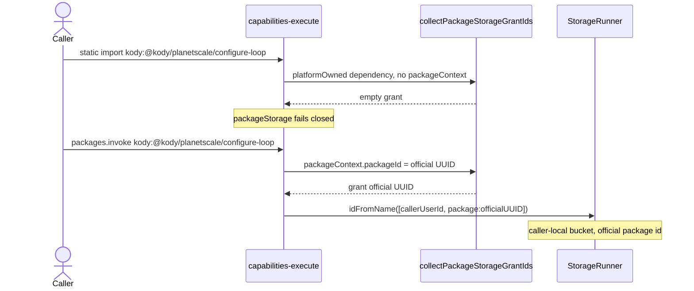

# Official `@kody/*` packageStorage (open question)

Not a decision. [0014](./decisions/0014-platform-live-packages.md) and
[0035](./decisions/0035-platform-packages-execute-only.md) settle live
resolution and execute-only composition. They do not settle whose durable bucket
a live official package reaches when it calls `packageStorage()`.

Write a numbered decision record only after Kent picks an option below.

## Question

Official `@kody/*` packages are usable from ad hoc `execute` without a fork.
[PR 1691](https://github.com/kentcdodds/kody/pull/1691) lets those modules read
the calling user's secrets. If such a package calls `packageStorage()`, whose
bucket is that, do callers share it, and should official packages persist at
all?

## What the worker does

Two call paths, two grant outcomes. Isolation is never a shared platform bucket.

**Storage identity** is always
`(callerUserId, package:{encodeURIComponent(packageId)})`:

- `storageRunnerDurableObjectName(userId, storageId)` in
  `packages/worker/src/user-scoped-durable-object-name.ts` names the
  StorageRunner `JSON.stringify([userId, storageId])`.
- `buildPackageStorageId(packageId)` in `packages/worker/src/storage-runner.ts`
  is `package:{encodeURIComponent(packageId)}`.
- `createPackageStorageKodyTools` takes `userId` from `callerContext.user`
  (`packages/worker/src/mcp/runtime-helper-manifest.ts`). Cross-user access is
  structurally impossible: the durable object is keyed on this run's user id.

**Static import** (`import … from 'kody:@kody/planetscale/configure-loop'`
inside ad hoc execute):

- The bundler records the dependency with `platformOwned: true`
  (`packages/worker/src/package-runtime/module-graph-workspace.ts`).
- Execute has no `packageContext` (live production: `packageContext` is `null`;
  raw `packageStorage()` in execute throws "requires package provenance").
- `collectPackageStorageGrantIds` in
  `packages/worker/src/mcp/run-kody-registry.ts` skips `platformOwned`
  dependencies. The comment on that skip is the 0014 rule: granting the platform
  package UUID would open an empty caller-local bucket, never the platform
  account's data, so the call fails closed.
- Live 2026-08-24: static import of `configure-loop` with `confirm: true` failed
  (no grant). Caller-owned static imports (`@kentcdodds/skills`) still reach
  that package's bucket. User secrets still resolve (`@kody/github/get-viewer` →
  `kody-bot`).

**`packages.invoke('kody:@kody/planetscale/configure-loop', { confirm: true })`:**

- `resolveSavedPackageBySpecifier` loads the platform row
  (`packages/worker/src/package-invocations/module-artifacts.ts` →
  `resolveSavedPackageImport`).
- `runSavedPackageModuleOnce` builds `callerContext.user` from `actor.userId`
  (the execute caller) and sets `packageContext.packageId` to the **official**
  saved-package UUID
  (`packages/worker/src/package-invocations/module-execution.ts`).
- `collectPackageStorageGrantIds` always grants `packageContext.packageId`. The
  `platformOwned` skip applies only to **dependencies**, not to the run itself.
- The write lands in the caller's StorageRunner under
  `package:{officialPackageId}`. Live 2026-08-24: invoke succeeded and wrote
  `{ organization: 'verify-only', database: 'verify-only' }`.
- `user_storage_buckets` registers that `storage_id` as `kind = 'package'` for
  the **caller**, even though the caller has no `saved_packages` row for that
  UUID.

0014's "stateless in the caller" rule is implemented only on the static-import
dependency grant. Invoke enters the official package as that package, so the
same UUID is granted as the run's own context.

A shared platform-account bucket would require naming the StorageRunner with the
platform account's `userId`. Execute and invoke never do that. Official package
**jobs** (and any official app) run as the platform account, so _those_ surfaces
would see `(platformUserId, package:{officialId})` — a different object from
every caller's invoke bucket.

## Isolation and leftovers

| Fact                                | Implication                                                                                                                                                                                                                                                   |
| ----------------------------------- | ------------------------------------------------------------------------------------------------------------------------------------------------------------------------------------------------------------------------------------------------------------- |
| DO name includes `callerUserId`     | Callers do not share invoke-path data. This is not a multi-tenant official bucket.                                                                                                                                                                            |
| `storageId` is the official UUID    | Every caller uses the same `storage_id` string. Inventory, export, and entitlements see a `package:` bucket whose package the user does not own.                                                                                                              |
| Fork creates a new UUID             | `community_fork` does not migrate the official-id bucket. Onboarding copy already warns that `kody:@kody/…` cannot use a fork's `packageStorage()`.                                                                                                           |
| Official jobs use the platform user | `poll-anomalies` on `@kody/planetscale` cannot read a caller's invoke-path configure-loop write. Recurring work still needs a person-owned fork ([0032](./decisions/0032-no-unattached-jobs.md), [0035](./decisions/0035-platform-packages-execute-only.md)). |
| Account deletion/export             | `user_storage_buckets` enumerates the leftover, so purge/export can find it. Package-scoped UI that lists only `saved_packages` hides it.                                                                                                                     |

Production residue from the 2026-08-24 verify invoke: one caller's
`package:16356751-16fa-4d04-bdc2-fb353ae2cb93` bucket (`@kody/planetscale`)
holds `{ organization: 'verify-only', database: 'verify-only' }`. That row is
independent of whichever option is chosen; clear or keep it as operator cleanup,
not as part of this note.

`docs/use/packages.md` says platform package code cannot use `packageStorage()`
in the user's account. That matches static import and 0014. It does not match
invoke.

## Official packages that already persist

`@kody/notify` (id `ec80188f-52ef-4d1c-bad4-905f66f441ce`) stores channel config
in `packageStorage()`. Its README says live `@kody/notify` storage is "the
platform package bucket, not the caller's" and tells agents to fork before
saving channels. The worker does not implement a shared platform bucket on
invoke; the README describes a tenancy fear the DO name already prevents, plus
the fork-first product the listing was written for.

`@kody/planetscale` (id `16356751-16fa-4d04-bdc2-fb353ae2cb93`)
`./configure-loop` "Save org/database/branch plus GitHub/Cursor targets in
packageStorage." The listing says it is meant to be forked. It also declares job
`poll-anomalies`. Without a fork, invoke can save knobs the official job will
never read.

Codemod `0006-invoke-object-to-specifier` leaves `@kody/notify`, `@kody/stash`,
and `@kody/personal-capture` docs manual so examples keep the installed fork
owner and that fork's `packageStorage()`.

## Options

### 1. Official packages stay stateless libraries

`packageStorage()` fails closed whenever the declaring package is
platform-owned, including `packages.invoke`. Person-owned forks keep working
(new UUID, caller-owned row).

- Matches 0014's "stateless in the caller" text and the usage-doc sentence.
- Secrets stay the 1691 exception: credentials are user-scoped; durable knobs
  are not.
- Official listings that persist (`notify`, `planetscale` configure-loop) become
  execute-time libraries: pass config as arguments or user secrets, or tell the
  user to fork.
- Invoke and static import agree. The access-denied hint that steers agents
  toward `packages.invoke` for "the package's own runtime" must stop applying to
  `@kody/*`.
- Privacy: no leftover official-id buckets in caller accounts (after cleanup).
- Cost: every official helper that wants a cursor or channel list needs a fork
  or a different store (secrets, memories).

### 2. Per-caller isolated bucket, no fork

Grant the official package UUID on both paths — including static import — so
`(user, officialPackageId)` is a real caller-local bucket.

- Matches what invoke already writes. Static import and Kent's preferred README
  style (`import`, not `invoke`) would persist the same way secrets already
  resolve.
- Tenancy is fine: still one StorageRunner per user.
- Does **not** make official packages into durable products. Jobs, apps, and
  webhooks stay execute-only / fork-required (0035, 0032). `poll-anomalies`
  still cannot see the caller's configure-loop write.
- Fork remains a data fork: empty new UUID, old official-id bucket stranded
  unless a migration exists.
- Inventory/UI must treat `package:{officialId}` as first-class caller data
  without a `saved_packages` row (export, deletion, storage-bytes, account
  screens).
- 0014's "do not open a misleading empty caller-local bucket" text has to be
  withdrawn: the bucket is the product.

### 3. Require a fork before any official `packageStorage` write

Same fail-closed gate as option 1. Product copy and official READMEs treat
`community_fork` as the install step for persistence (notify, planetscale,
stash, personal-capture already say this).

- Same implementation as option 1; the difference is agent/UX: "fork this
  listing" rather than "this helper is stateless."
- Preserves 0035: durable products live in the caller's scope.
- Execute can still import/invoke official code for secrets and one-shot work
  (1691 / 1699).
- Fork rewrite already remaps same-package `@kody/name` self-imports so the
  fork's `packageStorage()` is the fork UUID.

Option 1 vs 3 is framing, not a second storage home.

### 4. Document today's split (invoke writes, import fails)

The code already does this. `createPackageStorageAccessDeniedMessage` tells
authors to `packages.invoke` so "the package's own runtime" does the I/O.

- Least code. Most accident-prone: agents that follow Kent's import-not-invoke
  preference fail; agents that invoke persist under an official UUID the user
  does not own.
- Official jobs still cannot see those writes.
- Usage docs, 0014, notify's README, and the grant-skip comment all disagree
  with the invoke path.

This is the status quo, not a coherent product option.

### 5. Ban all person-account references to `@kody/*`

Ad hoc execute cannot statically import or `packages.invoke` a platform scope.
Person-owned packages already cannot
([0035](./decisions/0035-platform-packages-execute-only.md)). `@kody/*` becomes
catalog + fork source only. Platform-account packages may still compose with
each other.

- One rule for agents: you never run `kody:@kody/…` in a user account. Fork,
  then use `kody:@you/…`. The packageStorage question disappears — there is no
  live official declaring package in the caller's runtime.
- Pays the cost 0014 existed to avoid. Official helper bugfixes do not reach
  execute callers; every `@kody/github` / `@kody/notion` / `@kody/google` smoke
  test in the provider guides needs a fork first. Live 2026-08-24 `get-viewer`
  without a fork goes away.
- Reverses the 1691 product call (official packages are usable without forking
  for caller secrets) and the remaining execute-live half of 0014. 0035 already
  removed the durable-product half.
- Coherent if the operator wants official listings to be a catalog, not a
  runtime. Incoherent as a fix _for this storage question alone_: option 1
  closes the persist hole and keeps stateless helpers live.

### Not an option: shared platform bucket

A single `(platformUserId, package:{officialId})` store shared by every caller
would mix notify channels and PlanetScale orgs across tenants. The StorageRunner
name makes that unrepresentable on execute/invoke. Do not "fix" isolation by
dropping `userId` from the DO name.

## What a later decision must change

Pick 1 or 3 (fail closed on platform-owned declaring packages, invoke included),
pick 2 (grant the official UUID on static import too, and teach inventory/UI
about ownerless `package:` buckets), **or** pick 5 (ban person-account
`kody:@kody/…` in execute as well as saved packages). Then garden
`docs/use/packages.md`, provider guides, 0014's grant paragraph, the
`collectPackageStorageGrantIds` comment, official listing READMEs, and the
access-denied invoke hint so they tell the same story.

Do not add a new storage primitive. The homes are already StorageRunner +
`user_storage_buckets`.
