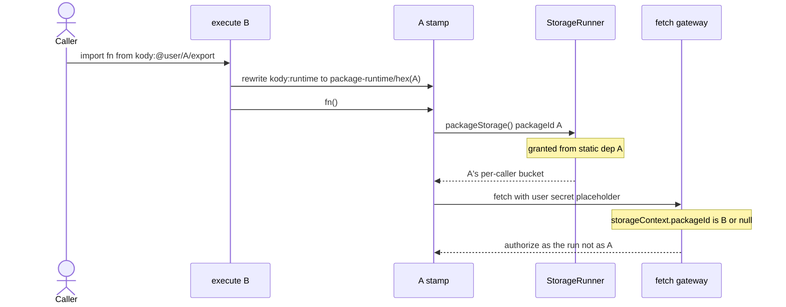
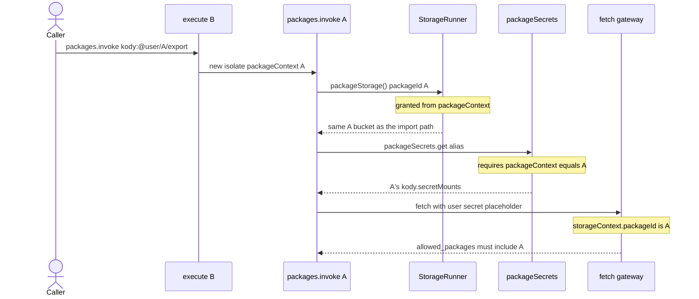
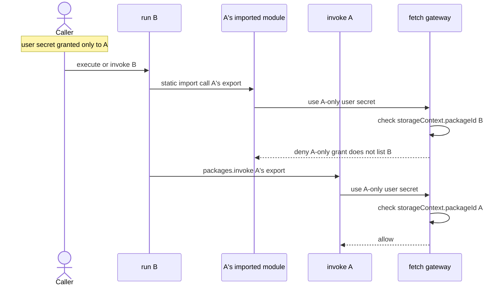
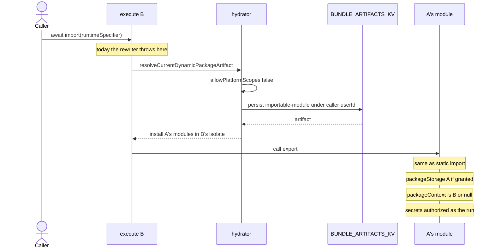
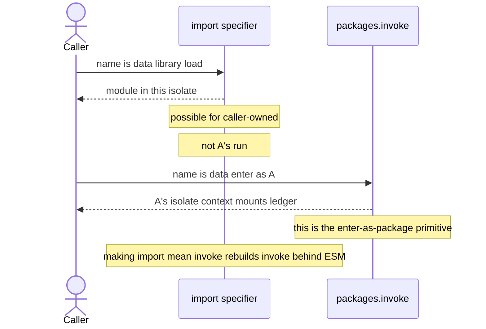

# `packageStorage()` on official static imports

Open design question. This note records how the grant path works and the options
for official `@kody/*` static imports. It does **not** pick a product option,
and it does not ask whether official packages should persist at all
(`packages.invoke` of an official target already writes).

Related: [0014](./decisions/0014-platform-live-packages.md) (grant exclusion),
[0035](./decisions/0035-platform-packages-execute-only.md) (execute-only person
packages), [#1337](https://github.com/kentcdodds/kody/pull/1337) (live platform
imports + fail-closed grants),
[#1691](https://github.com/kentcdodds/kody/pull/1691) (caller secrets on
official use), [#1699](https://github.com/kentcdodds/kody/pull/1699) (0035).

## What the code does

`packageStorage()` is two layers. The stamp routes identity; the grant is the
security boundary.

1. **Stamp (bundler).** Modules that originate from a saved package rewrite
   `kody:runtime` to `.__kody_virtual__/package-runtime/<hex(packageId)>.js`.
   That module closes `packageStorage` over the declaring package UUID. Ad hoc
   execute entry code is unstamped. See `createPackageRuntimeModuleSource` and
   `rewriteKodyImports`.
2. **Grant (host).** `collectPackageStorageGrantIds` in
   `packages/worker/src/mcp/run-kody-registry.ts` builds the set from
   host-controlled provenance only:
   - the run's `packageContext.packageId` (when the run _is_ a package)
   - each static dependency `packageId` where `platformOwned !== true`
   - dynamic-import artifact ids installed during hydration
3. **Enforce.** `createPackageStorageKodyTools` rejects any sandbox-supplied
   `packageId` outside that set. The StorageRunner name is
   `(callerUserId, package:{packageId})`, so a granted official UUID is still a
   **per-caller** bucket, never the platform account's data.

When the bundler resolves `kody:@kody/…` live, it records `platformOwned: true`
on that `BundleArtifactDependency` (`module-graph-workspace.ts`). The module
**is** stamped with the official UUID. The grant collector then **drops** that
id.

`packageContext` on a static import from execute stays `null`. Official code
that needs `packageContext` (hosted URL, app paths, secret mounts) still has to
`packages.invoke`.

## Why official static imports fail

This is the 0014 bound, not a leftover hole from 0035 / #1699.

0014: platform-owned dependency ids stay out of `packageStorage()` grants so
live platform code stays stateless in the caller. Granting the official UUID
would open an empty caller-local bucket, not the platform account's data. #1337
added the `platformOwned !== true` filter and the usage-doc sentence that
matches production.

0035 / #1699 reuse the same `platformOwned` flag for a different job: person
packages must not _run_ artifacts that recorded those deps. Execute may still
import and invoke official packages. #1699 does not change the grant collector.

#1691 is secrets only: user-scope `{{secret}}` placeholders resolve at the fetch
gateway for the calling user. That path never goes through
`collectPackageStorageGrantIds`.

## Live matrix (2026-08-24 production)

| Call                                                                          | Result                                                    |
| ----------------------------------------------------------------------------- | --------------------------------------------------------- |
| `import` `kody:@kody/github/get-viewer` (`github-bot`)                        | login `kody-bot` — caller secrets work                    |
| `import` `kody:@kentcdodds/skills/skill-list`                                 | 9 skills — caller-owned grant works                       |
| `import` `kody:@kody/planetscale/configure-loop` (`confirm: true`)            | fail closed — official id is stamped and excluded         |
| `packages.invoke('kody:@kody/planetscale/configure-loop', { confirm: true })` | writes `{ organization, database }` in the caller account |
| `packageContext` on static import from execute                                | `null`                                                    |
| raw `packageStorage()` in execute                                             | throws: requires package provenance                       |

`packages.invoke` of an official target enters that package's runtime. The grant
comes from `packageContext.packageId` (the official UUID), not from the
static-dep list, so the `platformOwned` filter never applies. The write lands in
`(callerUserId, package:{officialPackageId})` — the same per-caller isolated
official bucket a static-import grant would open.

The access-denied message still says “statically import so the bundler records
the dependency.” For an official static import the dependency **is** recorded;
the grant drops it. That teaching text is wrong for this case.

## Options (storage-on-import only)

Keep this separate from “should official packages persist at all.” Invoke
already persists. These options only answer: should a static import of that same
official module reach a bucket?

### A. Keep caller-owned-only grants

Leave `platformOwned !== true` in place. Official static imports stay
fail-closed. Official writes stay on `packages.invoke`. Fork-then-import remains
the durable person-package path (0035).

Matches 0014 (“stateless in the caller”). Conflicts with the import-not-invoke
README preference and with the mental model that “static import already has
`packageStorage`.”

### B. Grant the official UUID on static import

Drop the `platformOwned` exclusion in `collectPackageStorageGrantIds` (one
condition). The stamp already closes over the official UUID. The StorageRunner
is already caller-keyed. Static import and invoke of the same official package
would share `(callerUserId, package:{officialPackageId})`.

That is **not** a shared or platform-account bucket. It is the bucket invoke
already uses. The 0014 “misleading empty bucket” concern is weaker once invoke
writes that same id; the remaining surprise is that a library-style import
shares invoke state.

`packageContext` stays `null` on execute static import unless a separate change
sets it. Official packages that only need `packageStorage()` would work on
import; those that need package runtime context still need invoke.

Person-owned packages cannot statically import official packages (0035), so this
grant only matters for ad hoc execute and official-to-official composition. If
official `@kody/a` imports `@kody/b` and is invoked, granting `platformOwned`
deps would also let `b`'s stamped modules reach `b`'s per-caller bucket during
`a`'s run (`b` stays fail-closed without that grant).

### C. Document invoke-only for official writes

Keep the grant exclusion. Garden usage docs, README examples, and the
access-denied error so official persist paths name `packages.invoke`. Static
import stays the default for secret-using, stateless helpers (`@kody/github`).

No grant-path change. The import-not-invoke preference gets an official-persist
exception.

### D. Other shapes the code can support

- **Fork, then import.** Already works. The fork has a different package UUID,
  so its bucket is not the invoke-of-official bucket.
- **Synthetic caller-owned alias** (`package:official:{name}` or similar). New
  identity, not what invoke uses, more surprising than B.
- **Set `packageContext` on official static import.** Broader than storage
  (library import becomes a package run). Not required for B.
- **Per-module grants.** Grants are per-bundle. The host cannot grant “only the
  official module” without new machinery.
- **Revoke official persist entirely.** That is the separate product question.
  It would mean taking the `packageContext` grant away from official invoke too,
  which production does not do.

## Suggested decision test

If the answer is “official modules that persist should work the same way from
`import` and `invoke` for the calling user,” option B is the grant-path change:
one filter, the existing unit test in `package-import-resolution.node.test.ts`,
and usage-doc wording.

If the answer is “library import stays stateless; persist is a package run,”
option A or C: keep the filter, fix the teaching error, and keep README examples
that persist on invoke.

If person accounts still live-resolve `@kody/*` and the goal is that
`packages.invoke` becomes an **edge case**, **B is the least surprising
option.** Caller-owned static imports already persist. Official invoke already
writes `(callerUserId, package:{officialPackageId})`. B makes official static
import join that same world. A and C do the opposite.

If person accounts **do not run official packages** (draft
[0036](https://github.com/kentcdodds/kody/blob/cursor/official-kody-packagestorage-destination-3561/docs/contributing/decisions/0036-platform-packages-fork-only.md)
/ [#1741](https://github.com/kentcdodds/kody/pull/1741): execute import and
invoke of `@kody/*` both fail closed; fork first), **B is vacated.** There is no
official static-import grant to add. The person-account bucket is the fork's
UUID. Caller-owned static import already has `packageStorage()`. Invoke stays an
edge case for **your** packages (specifier-as-data, keyed exactly-once,
enter-as-package), not for official ones.

B does not eliminate invoke. After B, invoke still uniquely covers:

- the specifier is data, not a static `kody:@…` import
- keyed exactly-once (`idempotencyKey`)
- entering the package runtime: `packageContext`, `kody.secretMounts`, own
  isolate

`packageStorage()` identity is per-module (the stamp). `packageContext` is one
ambient per run. Two official static imports cannot each own `packageContext`.
Do not try to retire invoke by setting execute's `packageContext` to “the”
imported package.

Person-owned packages already static-import their own (or forked) modules with
grants. B only fills execute and official-to-official composition.

Do not grant a cross-user or platform-account bucket. The runtime cannot do that
by accident: the Durable Object name includes the calling user id.

## Recommended model (secrets, storage, context)

[0036](./decisions/0036-platform-packages-fork-only.md) landed: person accounts
fork `@kody/*` and then only run **their** copy. Three facts, one rule each:

| Thing              | Identity                         | Rule                                                                                        |
| ------------------ | -------------------------------- | ------------------------------------------------------------------------------------------- |
| `packageStorage()` | declaring module (bundler stamp) | A's code always hits `(callerUserId, package:{A.id})` when granted                          |
| `packageContext`   | the run                          | one ambient; A only when the run _is_ A                                                     |
| Secrets            | the run                          | user-secret `allowed_packages` and `packageSecrets` mounts check `storageContext.packageId` |

**Recommend:** static `import` when the name is known (library in this isolate).
Computed `import(specifier)` when the name is data (caller-owned / forks).
Workflows when you need exactly-once. Do not point `packageContext` at “the”
imported module. Computed `import()` is a library load, not invoke.

Static import of caller-owned A (including a fork). Storage follows A; the run
stays B or execute.

Invoke A. New run. Storage is still A's bucket. Secrets and context are A's.

A-only secret, B imports A vs B invokes A. This is the isolation the stamp does
**not** give you.

On ad hoc execute with no `packageId`, the `allowed_packages` check is skipped
(`assertPackageCanAccessResolvedSecret` returns). Execute can use **your** user
secrets. It still cannot use A's `packageSecrets` mounts.

## Dynamic `import()` is not impossible

Literal `import("kody:@...")` is still a teaching error: known names are static
imports. Computed `import(specifier)` for `kody:@` names currently facades
through the quarantined helper
([#1750](https://github.com/kentcdodds/kody/issues/1750)). The hydrator already
rebuilds caller-owned `importable-module` artifacts
(`resolveCurrentDynamicPackageArtifact` in `module-graph-hydration.ts`). After
that leftover is deleted, computed import should load those artifacts without
the invoke facade.

If the specifier is a **caller-owned** package and `import()` means “library
load in this isolate,” storage, context, and secrets match static import: A's
bucket, this run's `packageContext`, this run's secret authority. That is not
invoke.

0014 blocked **platform** dynamic import because that persist step writes under
the **caller**. A live `@kody/*` specifier would store an official artifact as
if the person owned it. Under 0036 person accounts cannot resolve `@kody/*` at
all, so that footgun does not apply to person execute. It is still a reason not
to re-open platform dynamic import if official live-resolve comes back.

`import()` cannot replace `packages.invoke` unless you lie about what `import()`
is. ESM `import()` has no `params`, no `idempotencyKey`, and does not start a
package run. To get A's mounts and A's `allowed_packages` you must start a run
whose `packageContext` is A — that is invoke, whatever the syntax. Overloading
`import()` to secretly invoke would make a side-effectful import that still has
nowhere honest to put a key or params.

