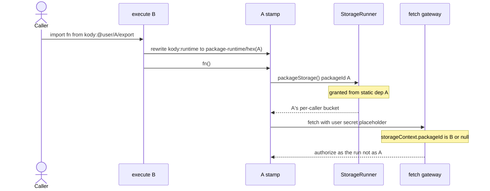
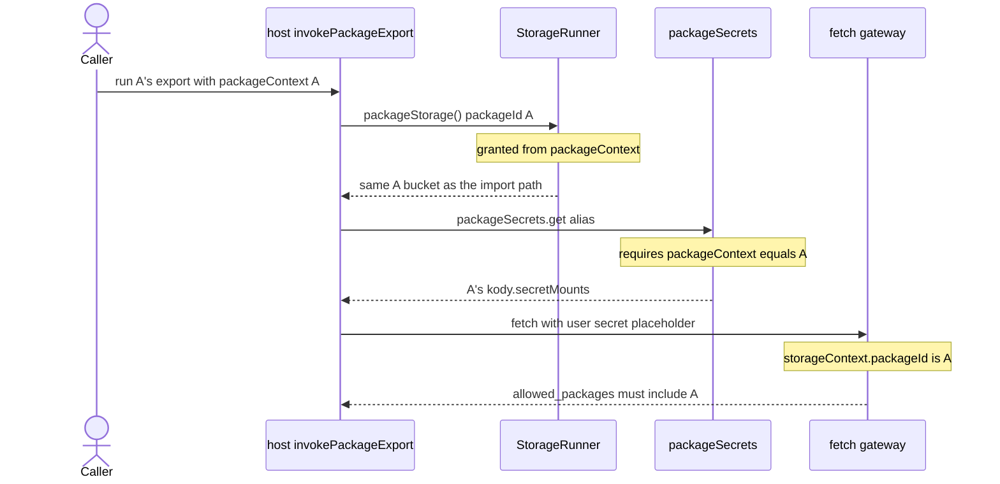
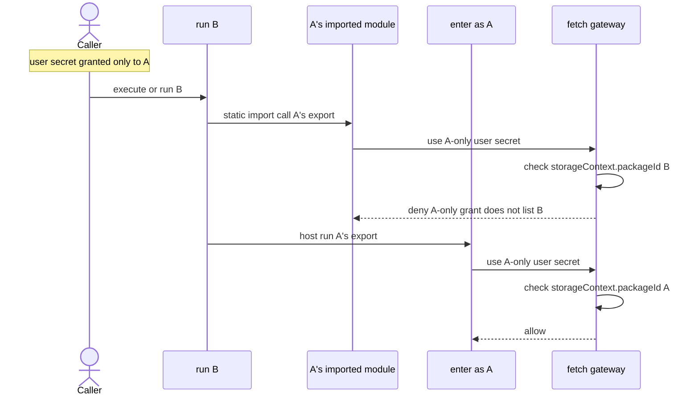
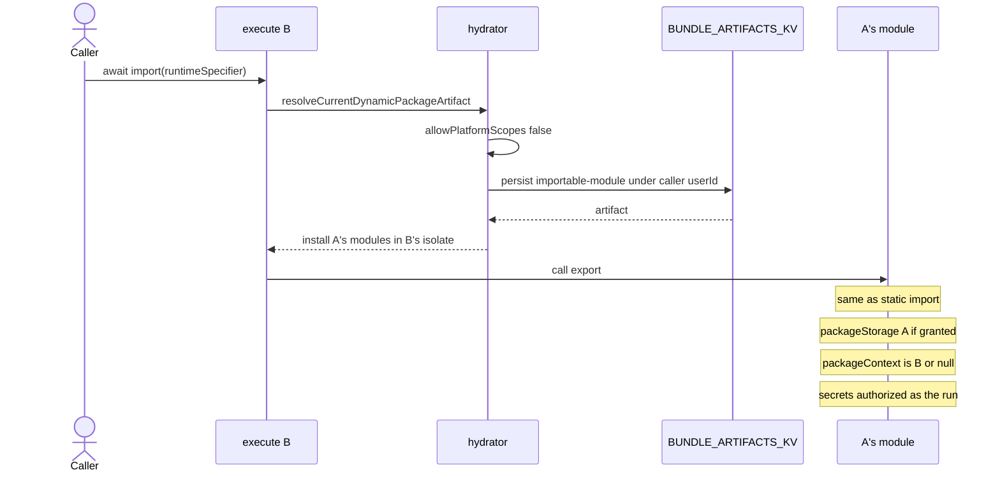
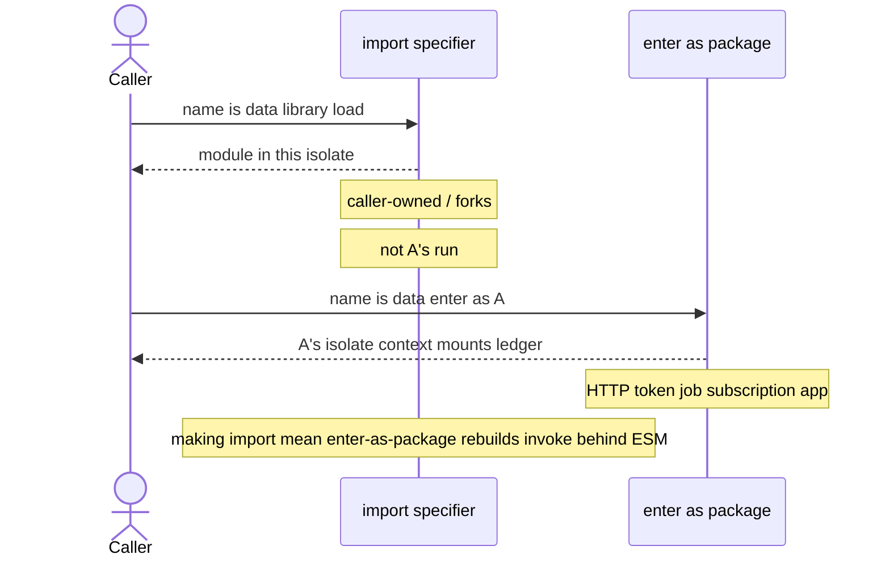

# `packageStorage()` grants and caller-owned packages

How `packageStorage()` identity and grants work under
[0036](./decisions/0036-platform-packages-fork-only.md) (person accounts fork
`@kody/*` before running it) and
[0037](./decisions/0037-no-author-packages-invoke.md) (authors compose with
static import / `import(specifier)` / workflows; external clients use HTTP
invocation tokens).

Related: [0014](./decisions/0014-platform-live-packages.md) (grant exclusion for
platform-owned static deps),
[#1337](https://github.com/kentcdodds/kody/pull/1337) (fail-closed grants),
[#1691](https://github.com/kentcdodds/kody/pull/1691) (caller secrets on
official use), [#1741](https://github.com/kentcdodds/kody/pull/1741) (0036),
[#1742](https://github.com/kentcdodds/kody/pull/1742) (0037).

## What the code does

`packageStorage()` is two layers. The stamp routes identity; the grant is the
security boundary.

1. **Stamp (bundler).** Modules that originate from a saved package rewrite
   `kody:runtime` to `.__kody_virtual__/package-runtime/<hex(packageId)>.js`.
   That module closes `packageStorage` over the declaring package UUID. Ad hoc
   execute entry code is unstamped. See `createPackageRuntimeModuleSource` and
   `rewriteKodyImports`.
2. **Grant (host).** `collectPackageStorageGrantIds` in
   `packages/worker/src/mcp/run-kody-registry.ts` builds the set from
   host-controlled provenance only:
   - the run's `packageContext.packageId` (when the run _is_ a package)
   - each static dependency `packageId` where `platformOwned !== true`
   - dynamic-import artifact ids installed during hydration
3. **Enforce.** `createPackageStorageKodyTools` rejects any sandbox-supplied
   `packageId` outside that set. The StorageRunner name is
   `(callerUserId, package:{packageId})`, so a granted id is always a
   **per-caller** bucket, never another account's data.

When the bundler would resolve `kody:@kody/…` live, it records
`platformOwned: true` on that `BundleArtifactDependency`
(`module-graph-workspace.ts`). The grant collector **drops** that id. Under
0036, person accounts do not live-resolve `@kody/*` at all — they
`community_fork` first — so the person-account bucket is the **fork's** UUID.
Caller-owned static imports already receive `packageStorage()` grants.

`packageContext` on a static import from execute stays `null`. Code that needs
`packageContext` (hosted URL, app paths, `kody.secretMounts`) must run as that
package: HTTP invocation tokens for external clients, or a job / subscription /
app surface. Authors do not get a `packages.invoke` composition helper (0037).

#1691 is secrets only: user-scope `{{secret}}` placeholders resolve at the fetch
gateway for the calling user. That path never goes through
`collectPackageStorageGrantIds`.

## Recommended model (secrets, storage, context)

Person accounts fork `@kody/*` and then only run **their** copy. Three facts,
one rule each:

| Thing              | Identity                         | Rule                                                                                        |
| ------------------ | -------------------------------- | ------------------------------------------------------------------------------------------- |
| `packageStorage()` | declaring module (bundler stamp) | A's code always hits `(callerUserId, package:{A.id})` when granted                          |
| `packageContext`   | the run                          | one ambient; A only when the run _is_ A                                                     |
| Secrets            | the run                          | user-secret `allowed_packages` and `packageSecrets` mounts check `storageContext.packageId` |

**Composition:** static `import` when the name is known (library in this
isolate). Computed `import(specifier)` when the name is data (caller-owned /
forks). Workflows when you need exactly-once. Do not point `packageContext` at
“the” imported module. Computed `import()` is a library load, not
enter-as-package.

Static import of caller-owned A (including a fork). Storage follows A; the run
stays B or execute.

Enter A as a package run (HTTP token, job, subscription, or app). New isolate.
Storage is still A's bucket. Secrets and context are A's.

A-only secret, B imports A vs B enters A as a package run. This is the isolation
the stamp does **not** give you.

On ad hoc execute with no `packageId`, the `allowed_packages` check is skipped
(`assertPackageCanAccessResolvedSecret` returns). Execute can use **your** user
secrets. It cannot use A's `packageSecrets` mounts.

## Dynamic `import()` for caller-owned names

Literal `import("kody:@...")` is a teaching error: known names are static
imports. Computed `import(specifier)` for `kody:@` names loads caller-owned /
forked modules. The hydrator rebuilds caller-owned `importable-module` artifacts
(`resolveCurrentDynamicPackageArtifact` in `module-graph-hydration.ts`). A
quarantined runtime helper still facades some computed loads
([#1750](https://github.com/kentcdodds/kody/issues/1750)); authors and agents do
not call that helper.

If the specifier is a **caller-owned** package and `import()` means “library
load in this isolate,” storage, context, and secrets match static import: A's
bucket, this run's `packageContext`, this run's secret authority. That is not
enter-as-package.

0014 blocked **platform** dynamic import because that persist step writes under
the **caller**. A live `@kody/*` specifier would store an official artifact as
if the person owned it. Under 0036 person accounts cannot resolve `@kody/*` at
all, so that footgun does not apply to person execute.

ESM `import()` has no `params`, no `idempotencyKey`, and does not start a
package run. To get A's mounts and A's `allowed_packages` you must start a run
whose `packageContext` is A — HTTP tokens, jobs, subscriptions, or apps. Do not
overload `import()` to secretly enter a package run.

## Why official static-import grants are vacated for person accounts

0014 excluded platform-owned dependency ids from `packageStorage()` grants so
live platform code stayed stateless in the caller. 0036 removed the
person-account live-resolve lane entirely: there is no official static-import
grant to add for person execute or person packages. The durable person-account
path is fork, then import the fork. Platform-account packages may still compose
with each other when the operator publishes them.

The access-denied message that says “statically import so the bundler records
the dependency” applies to **caller-owned** packages. For a platform-owned id
the dependency is recorded and the grant drops it — but person accounts never
reach that path under 0036.
