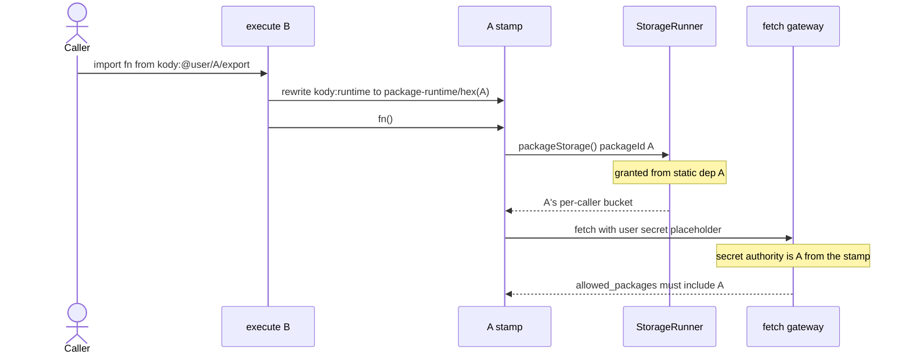
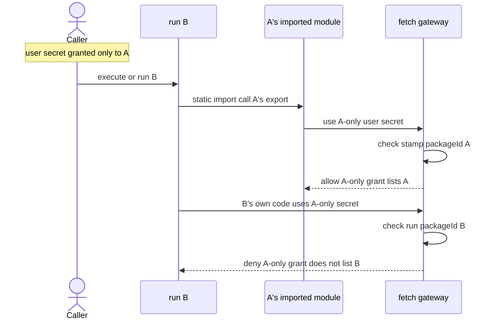
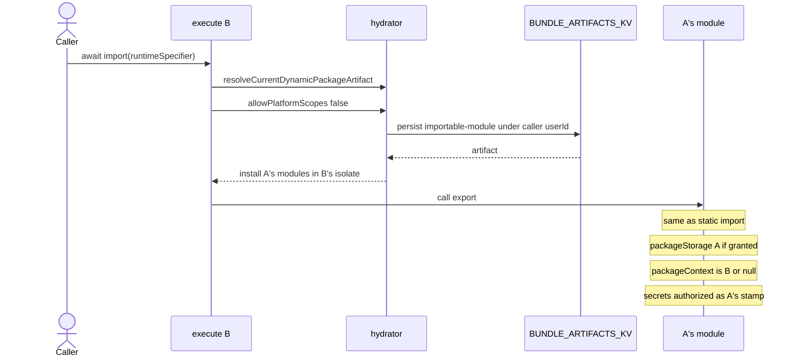
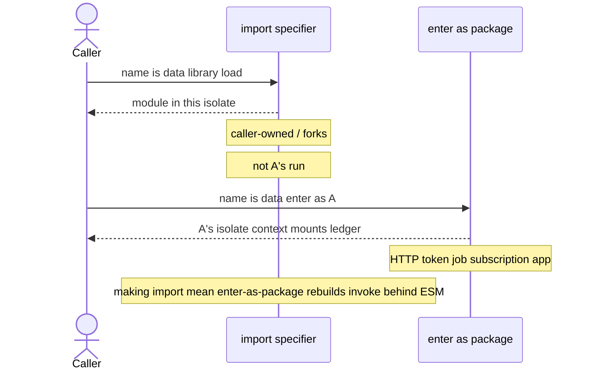

# `packageStorage()` grants and stamp-aligned secrets

How `packageStorage()` and user-secret authority work under
[0036](./decisions/0036-platform-packages-fork-only.md) (person accounts fork
`@kody/*` before running it) and
[0037](./decisions/0037-no-author-packages-invoke.md) (authors compose with
static import / `import(specifier)` / workflows; external clients use inbound
webhooks).

Related: [0014](./decisions/0014-platform-live-packages.md) (grant exclusion for
platform-owned static deps),
[#1337](https://github.com/kentcdodds/kody/pull/1337) (fail-closed grants),
[#1691](https://github.com/kentcdodds/kody/pull/1691) (caller secrets on
official use), [#1741](https://github.com/kentcdodds/kody/pull/1741) (0036),
[#1742](https://github.com/kentcdodds/kody/pull/1742) (0037).

## What the code does

`packageStorage()` and secret reads are two layers. The stamp routes identity;
the grant is the security boundary.

1. **Stamp (bundler).** Modules that originate from a saved package rewrite
   `kody:runtime` to `.__kody_virtual__/package-runtime/<hex(packageId)>.js`.
   That module closes `packageStorage` and `packageSecrets` over the declaring
   package UUID. Ad hoc execute entry code is unstamped. See
   `createPackageRuntimeModuleSource` and `rewriteKodyImports`.
2. **Grant (host).** `collectPackageStorageGrantIds` in
   `packages/worker/src/mcp/run-kody-registry.ts` builds the set from
   host-controlled provenance only:
   - the run's `packageContext.packageId` (when the run _is_ a package)
   - each static dependency `packageId` where `platformOwned !== true`
   - dynamic-import artifact ids installed during hydration
3. **Enforce.** `createPackageStorageKodyTools` rejects any sandbox-supplied
   `packageId` outside that set. Secret mounts (`packageSecrets`) do not take an
   author-selected package id on `kody.packageSecretGet` / `Has`. The host
   honors only the stamp identity (hidden ALS / capability field) or the run
   package, and only when that id is in the grant set. Then `allowed_packages` /
   implicit read checks run as that package. The StorageRunner name is
   `(callerUserId, package:{packageId})` for caller-owned packages, so a granted
   id is a **per-caller** bucket. Person-to-person
   [package share grants](../guides/package-sharing.md) are the exception:
   accepted grants route `packageStorage()` to the **owner's** bucket
   (`storageOwnerUserId`) so guests share one package state and the owner pays
   storage. Shared code still cannot read the guest's other user secrets.

When the bundler would resolve `kody:@kody/…` live, it records
`platformOwned: true` on that `BundleArtifactDependency`
(`module-graph-workspace.ts`). The grant collector **drops** that id. Under
0036, person accounts do not live-resolve `@kody/*` at all — they
`communityFork` first — so the person-account bucket is the **fork's** UUID.
Caller-owned static imports already receive `packageStorage()` grants and
stamp-aligned secret authority.

`packageContext` on a static import from execute stays `null`. Code that needs
the ambient run (hosted URL, app paths) must run as that package: inbound
webhooks for external clients, or a job / subscription / app surface. Authors do
not get a `packages.invoke` composition helper (0037).

Issue `#1691` is user-scope `{{secret}}` placeholders resolved at the fetch
gateway for the calling user. The gateway authorizes those placeholders as the
**stamp** when the call site is stamped (and the id is in the provenance set),
otherwise as the run.

## Recommended model (secrets, storage, context)

Person accounts fork `@kody/*` and then only run **their** copy. Three facts,
one rule each:

| Thing              | Identity                         | Rule                                                                                                      |
| ------------------ | -------------------------------- | --------------------------------------------------------------------------------------------------------- |
| `packageStorage()` | declaring module (bundler stamp) | A's code hits `(callerUserId, package:{A.id})` when granted; accepted share grants use the owner's bucket |
| `packageContext`   | the run                          | one ambient; A only when the run _is_ A                                                                   |
| Secrets            | declaring module (bundler stamp) | user-secret `allowed_packages` and `packageSecrets` mounts check the stamp when the call site is stamped  |

**Composition:** static `import` when the name is known (library in this
isolate). Computed `import(specifier)` when the name is data (caller-owned /
forks). Workflows when you need exactly-once. Do not point `packageContext` at
“the” imported module. Computed `import()` is a library load, not
enter-as-package.

Importing A is a trust decision that **A’s stamped code** may use secrets locked
to A (or A’s `kody.secretMounts`). A must not return secret values to callers.
B’s own code still cannot read an A-only secret. Writes (`secretSet` /
`secretDelete`) stay fail-closed: the stamp package still needs an
`allowed_packages` grant.

Static import of caller-owned A (including a fork). Storage and secrets follow
A; the run stays B or execute.

Enter A as a package run (HTTP token, job, subscription, or app). New isolate.
Storage is still A's bucket. Secrets and context are A's.

A-only secret, B imports A vs B’s own code. The stamp is what lets A’s export
succeed without granting the secret to B.

On ad hoc execute with no `packageId` and no stamp, the `allowed_packages` check
is skipped (`assertPackageCanAccessResolvedSecret` returns). Execute entry code
can use **your** user secrets through `{{secret}}`. It cannot use A's
`packageSecrets` mounts. A's stamped module, imported into that execute, uses
A's grants and mounts.

## Dynamic `import()` for caller-owned names

Literal `import("kody:@...")` is a teaching error: known names are static
imports. Computed `import(specifier)` for `kody:@` names loads caller-owned /
forked modules. The hydrator rebuilds caller-owned `importable-module` artifacts
(`resolveCurrentDynamicPackageArtifact` in `module-graph-hydration.ts`). A
quarantined runtime helper still facades some computed loads
([#1750](https://github.com/kentcdodds/kody/issues/1750)); authors and agents do
not call that helper.

If the specifier is a **caller-owned** package and `import()` means “library
load in this isolate,” storage, context, and secrets match static import: A's
bucket, this run's `packageContext`, A's stamp for secret authority when the
loaded module is stamped. That is not enter-as-package.

0014 blocked **platform** dynamic import because that persist step writes under
the **caller**. A live `@kody/*` specifier would store an official artifact as
if the person owned it. Under 0036 person accounts cannot resolve `@kody/*` at
all, so that footgun does not apply to person execute.

ESM `import()` has no `params`, no `idempotencyKey`, and does not start a
package run. Ambient `packageContext` stays this run. Do not overload `import()`
to secretly enter a package run.

## Why official static-import grants are vacated for person accounts

0014 excluded platform-owned dependency ids from `packageStorage()` grants so
live platform code stayed stateless in the caller. 0036 removed the
person-account live-resolve lane entirely: there is no official static-import
grant to add for person execute or person packages. The durable person-account
path is fork, then import the fork. Platform-account packages may still compose
with each other when the operator publishes them.

The access-denied message that says “statically import so the bundler records
the dependency” applies to **caller-owned** packages. For a platform-owned id
the dependency is recorded and the grant drops it — but person accounts never
reach that path under 0036.
