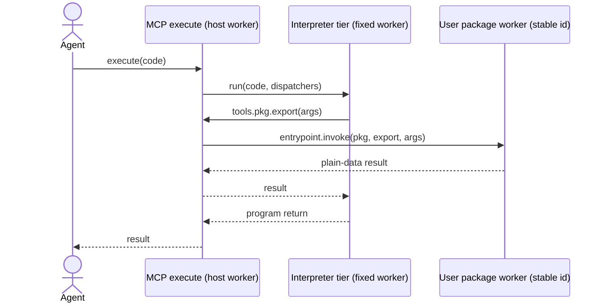

# Spike: package exports as RPC stubs and the Dynamic Worker fan-out cap

Follow-up to the fixed-interpreter spike in PR
[#2073](https://github.com/kentcdodds/kody/pull/2073). That spike shows that a
fixed interpreter worker collapses `execute`'s unique-worker bill, but
classifies any module that imports a `kody:@scope/pkg` export as
non-interpretable and routes it back to a unique V8 worker. This spike tests the
missing half: keep saved packages in V8 Dynamic Workers with stable ids, expose
their exports to the interpreter as `tools.*` stubs, and call them over Worker
Loader RPC.

The open question was whether the per-request fan-out across many package
workers is a real constraint. Cloudflare caps distinct Dynamic Workers per
request at four, and `packages/worker/src/dynamic-worker-evaluation-budget.ts`
already gates on that number.

## Verdict

**Per-package workers do not fit under the cap. One worker per user does.**

- **The cap counts distinct isolates, not calls.** Four package workers with 25
  parallel calls each (100 in flight) succeed. Five package workers with one
  call each fail on the fifth. The runtime error is
  `Dynamic worker concurrency limit exceeded: each request may have up to 4 concurrent dynamic worker invocations.`
- **A four-slot gate is not enough.** A semaphore that admits four workers at a
  time over twenty short calls fails sixteen of twenty. Three slots fail
  fifteen. Only two slots run clean. Explicit stub disposal after each call does
  not change this. Slot release lags call settlement, so cycling quickly through
  many workers trips the cap even when the caller respects the number. Kody's
  budget module admits four; under a package-per-worker design it would need to
  admit two.
- **Calls into one worker are cheap and unbounded.** 200 parallel calls into one
  entrypoint complete in 92 ms with no errors. Sequential calls cost 2–4 ms
  each. Calls on a returned `RpcTarget` session cost about 1 ms each, and 1,000
  of them settle in 892 ms as one billed request.
- **One worker is one thread.** Four parallel 73 ms CPU calls into one worker
  take 232 ms wall; eight take 575 ms. Fan-out buys CPU parallelism only across
  distinct workers, and the cap limits that to four.
- **The cap resets across a host hop.** A package worker calling back into the
  host through a `ctx.exports` binding, which then loads another package worker,
  runs under a fresh budget. Chains of depth six with seven workers alive pass.
  This matches what PR #1998 found from the other side (the async-local gate
  does not survive the dispatcher). It is observed behaviour, not documented,
  and not something to build on.

So the shape that works is **one Dynamic Worker per user holding every saved
package that user owns**, with the interpreter tier from #2073 calling into it
over RPC. One stub, no fan-out gate, ~2–4 ms per call, unlimited call
concurrency, and one unique worker per user per package-set version per day.
Per-package workers remain a valid escape hatch for a small number of packages
flagged heavy, spending the four slots on the exceptions.

## 1. Where fan-out enters the design

The #2073 recommendation is a two-tier `execute`: an interpreter tier for glue
programs and the V8 unique-worker tier for everything else. Its feature table
treats `kody:@scope/pkg` static imports as "same caveat as npm", so any program
that composes packages lands in the expensive tier. Kody's own `execute`
description tells agents to "prefer a package over rewriting helpers", which
pushes the interpretable share `q` down as agents follow it.

The alternative is to keep packages out of the interpreter entirely:



The package-run path in `packages/worker/src/package-invocations/` already loads
a saved package's `module` artifact into a Dynamic Worker keyed by user +
published commit + deploy, so each `(user, package, commit)` is one stable
worker. The question this spike answers is whether the host can fan out to many
of those inside one `execute` call.

## 2. What Cloudflare documents

Source:
[Dynamic Workers limits](https://developers.cloudflare.com/dynamic-workers/platform/limits/)
and the
[2026-08-28 changelog](https://developers.cloudflare.com/changelog/post/2026-08-28-durable-objects-dynamic-workers-limit/).

| Caller         | Distinct Dynamic Workers with in-flight requests |
| -------------- | ------------------------------------------------ |
| Worker request | 4                                                |
| Durable Object | 10 (raised from 4 on 2026-08-28)                 |

"Multiple in-flight requests to the same Dynamic Worker count as one toward this
limit." The only rationale given is that a Worker request has its own I/O
context while a Durable Object shares one across its concurrent requests. The
launch post notes that one-off Dynamic Workers "usually run on the same machine
— the same thread, even — as the Worker that created them", which is the likely
reason for a low fixed cap.

Billing is unchanged from #2073: unique workers are keyed by id + `WorkerCode`
per UTC day, each RPC call is one request, and calls on a returned `RpcTarget`
share the parent call's request.

## 3. Experiment

A throwaway Worker (`dw-fanout-spike`) with one `worker_loaders` binding,
`compatibility_date: 2026-04-16`, `nodejs_compat`, deployed to production
Cloudflare with `wrangler deploy` (wrangler 4.129.0) and driven with `curl` from
San Jose. Each "package" is a `WorkerEntrypoint` with a distinct id and distinct
code (a string constant baked in), `globalOutbound: null`, and one `ctx.exports`
loopback binding so the package can call the host. Full source in the appendix.
All timings are wall-clock milliseconds measured inside the host Worker with
`performance.now()`.

### T1 — distinct workers, one call each, all parallel

| Packages | Errors | Wall ms | Per-call p50 |
| -------- | ------ | ------- | ------------ |
| 4        | 0      | 25      | 25           |
| 5        | 1      | 30      | 28           |
| 8        | 4      | 55      | 16           |
| 20       | 16     | 6       | 0            |

The fifth worker fails immediately with the concurrency error. Failed calls cost
~0 ms; the runtime rejects before loading.

### T2 — distinct workers, sequential

| Packages   | Errors | Wall ms | Per-call p50 | p90 |
| ---------- | ------ | ------- | ------------ | --- |
| 5          | 0      | 81      | 17           | 17  |
| 20         | 0      | 319     | 16           | 18  |
| 20 (rerun) | 0      | 484     | 22           | 47  |

Sequential is always safe. Each distinct warm worker costs 15–20 ms per call,
which is the loader lookup plus a cross-isolate RPC.

### T3 — distinct workers through a host-side gate

A semaphore admitting `slots` workers at once over 20 packages, releasing the
slot when the call's promise settles:

| Slots | Dispose stub after call | Errors | Wall ms |
| ----- | ----------------------- | ------ | ------- |
| 4     | no                      | 16     | 26      |
| 4     | yes                     | 16     | 25      |
| 3     | no                      | 15     | 37      |
| 2     | yes                     | 0      | 137     |

Kody's `maxConcurrentDynamicWorkerEvaluationsPerRequest = 4` is the documented
number, but a gate at that number fails as often as no gate. The runtime's
notion of "in-flight" outlives promise settlement. Holding eight entrypoint
stubs alive across a sequential loop does not trip the cap, so it is not stub
count either; it is the time between settlement and slot release.

### T4 — one worker, many calls

| Path                               | Calls | Errors | Wall ms | Per-call p50 |
| ---------------------------------- | ----- | ------ | ------- | ------------ |
| sequential, reuse entrypoint       | 200   | 0      | 724     | 3            |
| sequential, fresh `get()` per call | 200   | 0      | 424     | 2            |
| sequential, reuse entrypoint       | 1000  | 0      | 4237    | 4            |
| sequential on `RpcTarget` session  | 200   | 0      | 198     | 1            |
| sequential on `RpcTarget` session  | 1000  | 0      | 892     | 1            |
| parallel                           | 4     | 0      | 4       | 3            |
| parallel                           | 50    | 0      | 46      | 14           |
| parallel                           | 200   | 0      | 92      | 92           |

No cap on call count or call concurrency into one worker. A returned `RpcTarget`
is 3–4× cheaper per call than the entrypoint and bills as one request, so a
package export that returns a session object is the right shape for hot loops.

### T5 — isolates × calls

| Workers | Calls each | In flight | Errors | Wall ms |
| ------- | ---------- | --------- | ------ | ------- |
| 4       | 25         | 100       | 0      | 72      |
| 2       | 50         | 100       | 0      | 111     |
| 5       | 2          | 10        | 2      | 3       |

Confirms the unit: distinct workers, not calls.

### T6 — CPU parallelism inside one worker

A 10M-iteration modular loop costs 73 ms alone.

| Parallel calls | Wall ms | Per-call range |
| -------------- | ------- | -------------- |
| 4              | 232     | 69–232         |
| 8              | 575     | 97–575         |

Calls into one worker serialize on its single thread. A user worker gets no CPU
parallelism between packages; per-package workers get up to four-way.

### T7 — nested chains through the host

Package → host binding → next package, depth `D`:

| Depth | Workers alive | Errors | Wall ms |
| ----- | ------------- | ------ | ------- |
| 1     | 2             | 0      | 41      |
| 3     | 4             | 0      | 16–76   |
| 6     | 7             | 0      | 69–209  |

Seven workers alive in one logical request, no error. Each hop through a
`ctx.exports` entrypoint starts a fresh request context with its own four-slot
budget. Kody's `runWithDynamicWorkerEvaluationBudget` restores its async-local
gate across the dispatcher hop (PR #1998), which is stricter than the platform;
the platform itself does not enforce the cap transitively.

## 4. What this means for a `tools.*` package design

| Design                          | Unique workers / user / day | Fan-out cap                     | Call cost        | CPU parallelism | Blast radius |
| ------------------------------- | --------------------------- | ------------------------------- | ---------------- | --------------- | ------------ |
| Today: inline into execute      | ≈ one per `execute` call    | n/a                             | 0 (same isolate) | none            | per call     |
| One worker per package          | one per package touched     | 4 distinct, effectively 2 gated | 15–20 ms         | up to 4-way     | per package  |
| **One worker per user**         | **one**                     | **none**                        | **2–4 ms**       | none            | per user     |
| Per user + heavy packages split | 1 + heavy count             | 4 for the heavy set             | mixed            | up to 4-way     | mixed        |

The per-user worker is the recommendation. Its costs, so they are not discovered
later:

- **Id rolls on any publish.** The worker id hashes the user's whole package
  set, so publishing one package rolls the id and cold-starts the next call.
  Deploys roll every user's id (same as today's `appCommitSha` in the hash).
  That is still one unique worker per user per day for most users.
- **Startup CPU scales with the package set.** Dynamic Workers bill isolate
  startup. A user with many packages and heavy npm graphs pays that parse on
  every cold start. Lazy `import()` of each package's module inside the user
  worker bounds it to packages the program touches; static hoisting of every
  package into the main module does not.
- **Package identity moves inside the worker.** Metering, `packageStorage()`
  routing, and `packageSecrets` mounts must derive from which package module the
  call entered, not which worker answered. The bundler's per-package
  `kody:runtime` stamp (`createPackageRuntimeModuleSource`) already does this
  for static imports; the user worker's `invoke(pkg, export, args)` entrypoint
  needs the same stamp plus host-side validation against the user's package
  list.
- **Enter-as-package semantics by default.** A stub call runs the package's code
  with `packageContext` set to that package and its secret mounts available.
  That is the "enter as package" model decision 0037 declined to hang on
  `import`. With explicit `tools.*` stubs it is the honest model and it removes
  the forgeable bundler-stamped metering ids, because the host knows which
  export it called.
- **Plain-data boundary.** Arguments and results cross RPC. Callbacks, streams,
  and class instances do not survive into an interpreter. Publish checks would
  need to reject exports whose signatures are not representable, the way the
  OpenAPI adapter in OpenCode's codemode skips operations it cannot encode.
- **One thread.** Compute-heavy packages block the user's other package calls
  for the duration. The heavy-package split above is the mitigation, and it
  needs a two-slot gate, not four.

## 5. Recommendation

1. **Reply to Rhys:** the four-worker cap is real and counts isolates, and a
   gate at four is not enough (two is). Per-package workers therefore do not
   compose. One worker per user removes the cap from the design entirely, at the
   cost of single-thread CPU and a package-set-wide id.
2. **If #2073's interpreter tier is pursued, pair it with a per-user package
   worker from the start** rather than routing package-importing programs to the
   V8 tier. That flips the sign on `q`: agents following "prefer a package" make
   more programs interpretable, not fewer.
3. **Do not size the fan-out gate from the docs.** If any design keeps multiple
   distinct Dynamic Workers per request, measure the safe slot count in
   production (this spike found 2) and treat the async-local gate's transitive
   restore in #1998 as Kody policy, not a platform guarantee.
4. **Raise the cap with Cloudflare.** The Durable Object limit moved from 4 to
   10 in August. The ask is either a higher Worker cap or counting in-flight
   calls instead of distinct isolates. A Durable-Object-hosted interpreter is a
   fallback that gets 10 slots today, untested here.
5. **Return `RpcTarget` sessions from hot exports.** 3–4× cheaper per call and
   one billed request per session.

## 6. What remains unverified

- The Cloudflare dashboard unique-worker count was not read for this spike, so
  the "one worker per user per day" figure rests on the documented id + code
  rule, not on an observed bill.
- The Durable Object 10-slot limit was not tested.
- Whether slot release tracks stub garbage collection or a fixed grace period.
  Sequential loops that hold eight stubs alive never trip the cap, and disposal
  does not free slots faster, so the lag is inside the runtime.
- Startup CPU for a realistic per-user bundle (tens of packages with npm deps)
  was not measured. Each package here is ~20 lines.
- First requests to the `workers.dev` hostname returned Cloudflare error 1042
  over IPv6 while `wrangler tail` showed the Worker completing with
  `outcome: ok`. Forcing IPv4 fixed it. This looks like an edge-side hostname
  issue, not a loader issue, and is noted so nobody reproduces the spike and
  stalls on it.
- A first version of the CPU test spun on `Date.now()`. Inside a Workers sync
  loop `Date.now()` does not advance, so the loop never exited and hit the CPU
  limit after ~290 s. The reported CPU numbers use a fixed iteration count.

## Appendix — spike source

Reproduce with `npm i wrangler@4.129.0` in an empty directory, then
`npx wrangler deploy` and `curl -4` the routes below.

`wrangler.jsonc`:

```jsonc
{
	"name": "dw-fanout-spike",
	"main": "src/index.js",
	"compatibility_date": "2026-04-16",
	"compatibility_flags": ["nodejs_compat"],
	"worker_loaders": [{ "binding": "LOADER" }],
	"observability": { "enabled": false },
}
```

`src/index.js`:

```js
import { WorkerEntrypoint, RpcTarget } from 'cloudflare:workers'

// One "package" per id; the constant makes each id's code distinct.
function packageSource(pkg) {
	return `
import { WorkerEntrypoint, RpcTarget } from "cloudflare:workers";
const PKG = ${JSON.stringify(pkg)};
let calls = 0;
class Session extends RpcTarget {
  call(name, args) { calls++; return { pkg: PKG, name, args, calls, viaSession: true }; }
}
export default class Pkg extends WorkerEntrypoint {
  ping() { return { pkg: PKG, calls }; }
  call(name, args) { calls++; return { pkg: PKG, name, args, calls }; }
  async callHost(name, args) { calls++; const r = await this.env.HOST.hostCall(name, args); return { pkg: PKG, name, host: r, calls }; }
  session() { return new Session(); }
  burn(iters) { let x = 0; for (let i = 0; i < iters; i++) x = (x * 31 + i) % 1000003; return x; }
}`
}

// Host binding exposed to package workers (package -> host -> package chains).
export class Host extends WorkerEntrypoint {
	async hostCall(name, args) {
		const depth = args?.depth ?? 0
		if (depth <= 0) return { name, depth, leaf: true }
		const next = getPkg(this.env, this.ctx, `chain-${depth}`)
		return await next.callHost(name, { depth: depth - 1 })
	}
}

const VERSION = 'v3'
function getPkg(env, ctx, pkg) {
	const stub = env.LOADER.get(`pkg-${VERSION}-${pkg}`, () => ({
		compatibilityDate: '2026-04-16',
		compatibilityFlags: ['nodejs_compat'],
		mainModule: 'pkg.js',
		modules: { 'pkg.js': packageSource(pkg) },
		env: { HOST: ctx.exports.Host({ props: { pkg } }) },
		globalOutbound: null,
	}))
	return stub.getEntrypoint()
}

function timed(fn) {
	const t = performance.now()
	return Promise.resolve()
		.then(fn)
		.then(
			(value) => ({ ok: true, ms: +(performance.now() - t).toFixed(2), value }),
			(err) => ({
				ok: false,
				ms: +(performance.now() - t).toFixed(2),
				error: String(err?.stack || err),
			}),
		)
}
function stats(arr) {
	const s = [...arr].sort((a, b) => a - b)
	const q = (p) => s[Math.min(s.length - 1, Math.floor(p * s.length))]
	return { n: s.length, min: s[0], p50: q(0.5), p90: q(0.9), max: s.at(-1) }
}
function summary(test, extra, results, t0) {
	const errs = results.filter((r) => !r.ok)
	return {
		test,
		...extra,
		wallMs: +(performance.now() - t0).toFixed(1),
		errors: errs.length,
		firstError: errs[0]?.error,
		perCall: stats(results.map((r) => r.ms)),
	}
}

export default {
	async fetch(request, env, ctx) {
		const url = new URL(request.url)
		const n = (k, d) => Number(url.searchParams.get(k) ?? d)
		const t0 = performance.now()
		const json = (o) =>
			new Response(JSON.stringify(o, null, 1), {
				headers: { 'content-type': 'application/json' },
			})
		switch (url.pathname) {
			case '/fanout': {
				const N = n('packages', 10)
				const results = await Promise.all(
					Array.from({ length: N }, (_, i) =>
						timed(() => getPkg(env, ctx, `p${i}`).call('x', { i })),
					),
				)
				return json(summary('fanout-parallel', { N }, results, t0))
			}
			case '/fanout-seq': {
				const N = n('packages', 10)
				const results = []
				for (let i = 0; i < N; i++)
					results.push(timed(() => getPkg(env, ctx, `p${i}`).call('x', { i })))
				return json(
					summary('fanout-seq', { N }, await Promise.all(results), t0),
				)
			}
			case '/fanout-gated': {
				const N = n('packages', 20)
				const slots = n('slots', 4)
				let active = 0
				const waiters = []
				const acquire = () =>
					new Promise((r) => {
						if (active < slots) {
							active++
							r()
						} else waiters.push(r)
					})
				const release = () => {
					const w = waiters.shift()
					if (w) w()
					else active--
				}
				const results = await Promise.all(
					Array.from({ length: N }, async (_, i) => {
						await acquire()
						try {
							return await timed(() =>
								getPkg(env, ctx, `p${i}`).call('x', { i }),
							)
						} finally {
							release()
						}
					}),
				)
				return json(summary('fanout-gated', { N, slots }, results, t0))
			}
			case '/fanout-x-calls': {
				const N = n('packages', 4)
				const K = n('calls', 25)
				const eps = Array.from({ length: N }, (_, i) =>
					getPkg(env, ctx, `p${i}`),
				)
				const results = await Promise.all(
					eps.flatMap((ep, i) =>
						Array.from({ length: K }, (_, j) =>
							timed(() => ep.call('x', { i, j })),
						),
					),
				)
				return json(summary('fanout-x-calls', { N, K }, results, t0))
			}
			case '/loop': {
				const M = n('calls', 100)
				const reuse = url.searchParams.get('reuse') !== '0'
				const ep = getPkg(env, ctx, 'loop')
				const results = []
				for (let i = 0; i < M; i++) {
					const target = reuse ? ep : getPkg(env, ctx, 'loop')
					results.push(await timed(() => target.call('x', { i })))
				}
				return json(summary('loop-seq', { M, reuse }, results, t0))
			}
			case '/loop-par': {
				const M = n('calls', 100)
				const ep = getPkg(env, ctx, 'loop')
				const results = await Promise.all(
					Array.from({ length: M }, (_, i) => timed(() => ep.call('x', { i }))),
				)
				return json(summary('loop-parallel', { M }, results, t0))
			}
			case '/session': {
				const M = n('calls', 100)
				using session = await getPkg(env, ctx, 'loop').session()
				const results = []
				for (let i = 0; i < M; i++)
					results.push(await timed(() => session.call('x', { i })))
				return json(summary('session-seq', { M }, results, t0))
			}
			case '/busy': {
				const M = n('calls', 4)
				const iters = n('iters', 10_000_000)
				const ep = getPkg(env, ctx, 'busy')
				const results = await Promise.all(
					Array.from({ length: M }, () => timed(() => ep.burn(iters))),
				)
				return json(summary('busy-parallel', { M, iters }, results, t0))
			}
			case '/chain': {
				const D = n('depth', 3)
				const r = await timed(() =>
					getPkg(env, ctx, 'chain-root').callHost('x', { depth: D }),
				)
				return json({ test: 'chain', D, ...r })
			}
			default:
				return new Response(
					'routes: /fanout /fanout-seq /fanout-gated /fanout-x-calls /loop /loop-par /session /busy /chain',
					{ status: 404 },
				)
		}
	},
}
```
