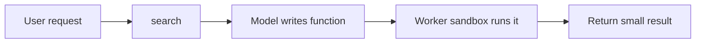
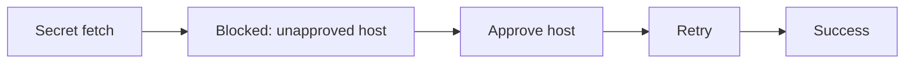

# Build a Free Agent 🐨

## Personal assistant, your stack

<!--
Open with the product and emotional context: practical building blocks for
personal assistants — built to solve my problems, maybe yours too.
-->

---

# I love my view

<figure class="kody-hero-photo">
  
</figure>

<!--
Establish the home office and the view — the "why automate the window" hook.
-->

---

# I don't love sun glare

<figure class="kody-hero-photo">
  
</figure>

<!--
Same space, harsh glare — the problem you feel in real rooms, not abstract "IoT."
-->

---

# Kody controls my shades

<figure class="kody-hero-photo">
  
</figure>

<!--
Shade down — comfortable again. Kody actually runs the integration, not a slide joke.
-->

---

# Kody built and deployed this app

<figure class="kody-hero-photo">
  
</figure>

<!--
Shape & Color Match — link goes to X post for live game and fuller story.
-->

---

# Kody built this app

<figure class="kody-hero-photo">
  
</figure>

<!--
StreamBeats-style player + DevTools Network + little PiP excitement — X post has context.
-->

---

# Kody setup a Cloudflare tunnel to my home network

<figure class="kody-hero-photo">
  
</figure>

<!--
Cloudflare tunnel into home network — practical "reach my stuff safely" moment; X post for details.
-->

---

# Kody shipped a landing page on epic.engineer

<figure class="kody-hero-photo">
  
</figure>

<!--
Epic Engineer landing — shipped from the same assistant story arc; X post for preview.
-->

---

# And it did all of this for free

<h2 v-click>Because I did it here:</h2>

<figure class="kody-hero-photo kody-hero-triptych">
  <v-click>
    

      
    

  </v-click>
  <v-click>
    

      
    

  </v-click>
  <v-click>
    

      
    

  </v-click>
</figure>

<!--
Triptych: Claude at Disneyland (Fly VM / OOM), ChatGPT opening shades, Cursor
on sheers schedule — same Kody, different hosts. "Because it did this here" is
the punchline: not tied to one chat app or one machine.
-->

---

# Why I needed this

- **Open Claw** → **cost** stress
- **Config** never felt "done"
- **Secrets** felt fragile
- No **home server**
- **Fly** deploy felt heavy

<!--
Open Claw was useful, but the cost model made experimentation stressful. I was
never fully confident everything was configured correctly. Secrets management
felt risky and fragile. I did not want a personal assistant on a computer in my
house. Deploying to external infra like Fly felt more complicated than it should.

Punchline: I wanted the benefits of a personal assistant without turning my
life into an ops project.
-->

---

# What I actually wanted

- **BYO** host + model (existing sub)
- **Secrets** out of prompt, bounded
- **Integrations** without forking the agent
- **UI** you can save as real apps
- **No** home hosting / bespoke deploy
- **MCP** everywhere, no context bloat

<!--
Kody is my answer to those constraints. Use whatever agent host and model you
want with your existing subscription. Keep secrets constrained, auditable, and
out of the model prompt. Add integrations without code changes to the agent.
Generate and save UI apps as reusable software. Avoid self-hosting at home and
bespoke deploy complexity. Build once; works anywhere MCP works.

Now the rest of the talk explains how Kody solves those problems.
-->

---

# The 3 MCP tools

<v-clicks>

- **`search`** — discover
- **`execute`** — run (Codemode)
- **`open_generated_ui`** — ship UI

</v-clicks>

<!--
Map for the rest of the talk: discovery, execution, UI escape hatch.

`search` finds capabilities, saved skills, saved apps, and secret references.
`execute` runs an async function in Codemode to compose capability calls.
`open_generated_ui` opens dynamically generated MCP Apps.

Cadence: search first, execute when the plan is clear, open UI when chat is the
wrong surface.
-->

---

# `execute` runs Codemode

## One function, not 50 tool calls

- Model writes **JS** once
- **`codemode`** methods = your capabilities
- **Worker** sandbox

`@cloudflare/codemode`

<!--
Central to how Kody works. Cloudflare Codemode lets the model write a short
JavaScript function instead of one tool call at a time. The code gets a
`codemode` object whose methods are the tools you expose — I call those
"capabilities". It runs in an isolated Worker sandbox. Models are often better at
small programs than long tool-call chains. Kody's `execute` tool is exactly this:
one "write code" tool, not a giant bag of disconnected tool calls.
-->

---

# Search is the discovery layer

- **Ranked** hits (order matters)
- **`entity: "{id}:{type}"`** → full doc + schema
- Thin results → **rephrase** or check registry

<!--
`search` returns ranked hits across capabilities, saved skills, saved apps, and
secret references. Top hits are what the agent should inspect first. Without
`search`, `execute` is just guessing names and input shapes.

Answers "how does the model know what tools exist?" before execution.
-->

---

# Kody's core loop

- **search** → names/schemas · **execute** → plan

<!--
Ties discovery and execution before the value-prop section. `search` finds names
and schemas; `execute` runs the plan.
-->

---

# Memory stays lean

- **`conversationId`**
- **`memoryContext`** — **few** hits, **on demand**
- Same **payload** as search / execute — no side channel
- **`meta_memory_verify`** → upsert / delete / skip

<!--
Reuse conversationId from prior tool responses in the same conversation (omit on
first call; use the id Kody returns after). That ties calls together and lets Kody
avoid surfacing the same long-term memory repeatedly in one thread.

memoryContext is an optional, short, task-focused hint (task, query, important
entities, constraints). When the agent includes it, Kody may return a small
conservative set of relevant memories alongside the normal tool payload — same
pattern for search and execute — rather than a separate wall of context.

Mutating durable memory is verify-first: call meta_memory_verify, review the
related memories Kody returns, then decide meta_memory_upsert, meta_memory_delete,
both, or nothing. Kody retrieves and suggests; the consuming agent decides meaning.

docs/use/memory.md
-->

---

# 1. No inference bill

- Kody = **runtime** + integrations + persistence
- Host picks the **model**
- Value = **search, execute, policy, apps, OAuth**
- Stack on subs you **already** pay for

<!--
Your agents already do inference well; Kody gives them hands. Product value is
not "Kody has the smartest model." Use Kody on existing subscriptions instead of
"just one more, bro."
-->

---

# 2. It runs anywhere MCP runs

- **MCP server**, not a chat app
- Any **MCP host** works
- Compounds in **capabilities, apps, secrets, skills**

<!--
Portability: investment is the runtime layer — capabilities, saved apps,
secrets, skills — not the current chat client. Bring your own agent, same runtime.
-->

---

# 3. Secrets with real boundaries

- **UI** to capture — not in context
- Agent sees **metadata** only
- Placeholders → **secret-aware** paths only
- **Approved** capabilities + hosts
- Admin **approves** which hosts get access

<!--
Major differentiator: save vs approve are different steps. Agent never needs raw
secret; unapproved egress stays blocked.
-->

---

# 4. `open_generated_ui` turns chats into apps

- Chat ≠ only UI
- **Generate** + show inline
- **Save** → reopen later
- UI → **server** for secrets / OAuth / APIs

<!--
Chat can launch the app; the app becomes durable software. Model generates UI;
user can save as saved app. UI calls back for secrets, OAuth, approved API access.
-->

---

# 5. OAuth is built in

- Beyond raw tokens → **full OAuth** when needed
- Kody **guides** provider setup
- **authorize → callback → exchange → persist → refresh**

<!--
Integrations become configuration, not auth plumbing. Standard path is usually
enough; generated UI OAuth is the exception, not the default.
-->

---

# Why this compounds

- One account → **automation** + **apps**
- One **OAuth** → many workflows
- One **app** → durable internal tool
- One **capability** → many hosts
- Experiments → **personal infra**

<!--
Why it sticks: connected account powers automation and saved apps; OAuth fans out;
saved app becomes internal tool; capability portable across MCP hosts.
-->

---

# Takeaway

- No **inference** bill
- **Any** MCP host
- **Secrets** bounded
- **UI** → saved software
- **OAuth** in the box

<!--
MCP as runtime, not just chat. Thank you / Q&A: heykody.dev, docs/use/index.md,
this repo.
-->

---
layout: center
---

# Live demo cheat sheet

1. **`search`** — no creds needed
2. **`execute`** — one safe read-only path
3. **`open_generated_ui`** — "software, not chat"
4. **Secrets** — slide only (`/connect/secret`, `/connect/oauth`), not live

<!--
Appendix if extra time. `search`: show capabilities or saved app without
credentials. `execute`: one public-safe read-only workflow. `open_generated_ui`:
reopen saved app for the software moment. Stop before live secrets — show URLs in
deck only.
-->
