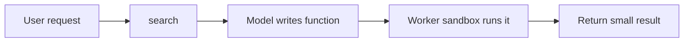
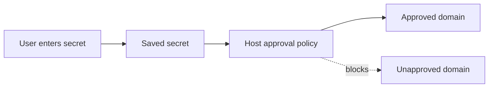

# Kody

## Practical building blocks for personal assistants

### Built to solve my problems, maybe yours too.

<!--
Open with the product and the emotional context for why it exists.
-->

---

# Why I needed this

- Open Claw was useful, but the **cost model** made experimentation stressful
- I was never fully confident I had everything **configured correctly**
- **Secrets management** felt risky and fragile
- I did not want to run a personal assistant on a computer in **my house**
- Deploying it to external infra like **Fly** felt more complicated than it should

**I wanted the benefits of a personal assistant without turning my life into an ops project.**

---

# What I actually wanted

- Use whatever **agent host** and **model** I want (with my existing subscription)
- Keep secrets constrained, auditable, and out of the model prompt
- Add integrations without needing code changes to the agent
- Generate and save UI apps that can be reused as real software
- Avoid self-hosting at home and avoid bespoke deploy complexity
- Build once and have it work anywhere MCP works (all without context bloat)

**Kody is my answer to those constraints.**

<!--
Now the rest of the talk can explain how Kody solves those real problems.
-->

---

# The 3 MCP tools

- **`search`** finds capabilities, saved skills, saved apps, and secret references
- **`execute`** runs an async function in Codemode to compose capability
  calls
- **`open_generated_ui`** opens dynamically generated MCP Apps

**Search first. Execute when the plan is clear. Open UI when chat is the wrong surface.**

<!--
This is the map for the rest of the talk: discovery, execution, and a UI escape
hatch when chat is not enough.
-->

---

# `execute` runs Codemode

## Central to how Kody works

- Cloudflare Codemode lets the model write a short **JavaScript function**
  instead of making one tool call at a time
- That code gets a **`codemode`** object whose methods are the tools you expose (I call these "capabilities")
- The function runs in an isolated **Worker sandbox**
- This works well because models are often better at writing small programs than
  at managing long tool-call chains

**Kody's `execute` tool uses this exact idea.**

Using `@cloudflare/codemode`

<!--
This is the conceptual bridge: one "write code" tool, not a giant bag of
disconnected tool calls.
-->

---

# Search is the discovery layer

- **`search`** returns ranked hits across capabilities, saved skills, saved
  apps, and secret references
- The order matters because the top hits are what the agent should inspect first
- Use **`entity: "{id}:{type}"`** to get full markdown and schema for one result
- If results look thin, rephrase the query or read the live capability registry

**Without `search`, `execute` is just guessing names and input shapes.**

<!--
This slide answers "how does the model know what tools exist?" before we move
back into execution.
-->

---

# Kody's core loop

- **`search`** finds names and schemas; **`execute`** runs the plan

<!--
This ties discovery and execution together before the value-prop section.
-->

---

# 1. No inference bill

- Kody is the **runtime**, integration layer, and persistence layer
- Your agent host still chooses the **model** (Claude, GPT, Cursor, etc...)
- The value is in **search, capabilities, execution, policy, apps, and OAuth**
- Use Kody on top of existing AI subscriptions instead of buying "just one more, bro"

**Your agents already do inference well. Kody gives them hands.**

<!--
Emphasize that the product value is not "Kody has the smartest model."
-->

---

# 2. It runs anywhere MCP runs

- Kody is an **MCP server**, not a bespoke chat surface
- If the host speaks MCP, the host can use Kody
- Your investment compounds in **capabilities, saved apps, secrets, and skills**

**Bring your own agent. Keep the same runtime.**

<!--
This is the portability slide. The thing that persists is the runtime layer, not
the current chat client.
-->

---

# 3. Secrets with real boundaries

- Use **`/connect/secret`** or generated UI instead of pasting credentials in
  chat
- The agent can inspect **secret metadata**, but not plaintext values
- Secret placeholders resolve only in **secret-aware** paths
- Saving a secret does **not** approve sending it anywhere
- Only the account admin UI can approve which hosts may receive that secret

**The agent never needs the raw secret, and unapproved egress stays blocked.**

<!--
This is a major differentiator. Be explicit that save and approve are different
steps.
-->

---

# 4. `open_generated_ui` turns chats into apps

- Chat is not always the right interface
- **`open_generated_ui`** takes either inline **`code`** or a saved **`app_id`**
- Use it for dashboards, forms, callback pages, and any flow where the user
  should click instead of paste into chat
- **`ui_save_app`** persists that UI so you can reopen it later instead of
  regenerating it
- Saved apps can stay hidden or show up in **`search`** when you want reuse
- The UI can call back into server-side code for secrets, OAuth, and approved
  API access

**Chat can launch the app, but the app becomes durable software.**

---

# 5. OAuth is built in

- Default path: hosted **`/connect/oauth`**
- Kody handles **authorize -> callback -> token exchange -> persistence**
- You mostly provide provider configuration and the correct redirect URI
- If you need branded UX or a callback on a saved app URL, there is an
  edge-case path for generated UI OAuth

**Building integrations becomes configuration work, not auth plumbing.**

<!--
Mention that the standard path is almost always enough; generated UI OAuth is
the exception, not the default.
-->

---

# Not toy examples

These are **production-shaped** artifacts in my Kody account:

- **Cursor Agent PR dashboard** — Cursor + GitHub, polling, CI context
- **Tesla Energy Live** — OAuth, live energy data
- **Skills** — agent status, open PRs, follow-up on an agent, Cloudflare API v4

Add `public/demo/cursor-pr-dashboard.png` (and optionally `tesla-energy.png`)
after export.

<!--
Repo ships a 1×1 placeholder PNG so production builds succeed; swap in a real screenshot before presenting.
-->

---

# Walkthrough — PR dashboard

1. **Search** finds the saved app and related capabilities
2. **`open_generated_ui`** reopens the saved app instead of rebuilding the UI
   each time
3. The app executes server-side code with **secret-backed** API calls
4. If a host is not approved, the flow stops and sends the user to approval
5. The same integration can also power repeatable skills and scripts

**Same runtime, multiple surfaces: app, skill, or agent command.**

<!--
This is the concrete demo story that proves the earlier claims.
-->

---

# Why this compounds

- A connected account can power both **automation** and **saved apps**
- One OAuth connection can feed many workflows
- One saved app can become a durable internal tool
- One capability can work across many MCP hosts
- That is how Kody turns agent experiments into personal infrastructure

<!--
This is the "why it sticks" slide.
-->

---

# Takeaway

- No inference bill
- Any MCP host can use it
- Secrets stay out of the agent and off unapproved domains
- Generated UI can be saved and reopened as real software
- OAuth is built in, so integrations are straightforward

**That is MCP as runtime, not just chat.**

<!--
Thank you / Q&A. Offer links: heykody.dev, docs/use/index.md, this repo.
-->

---
layout: center
---

# Live demo cheat sheet

1. **`search`** — show capabilities or a saved app without needing credentials
2. **`execute`** — do one public-safe read-only workflow
3. **`open_generated_ui`** — reopen the saved app if you want the "software, not
   chat" moment
4. **Stop before secrets** — show **`/connect/secret`** or **`/connect/oauth`** in
   the deck, not live credentials

<!--
Appendix slide — use if you have extra time; keeps the main deck at 12 slides + this optional 13th.
-->
