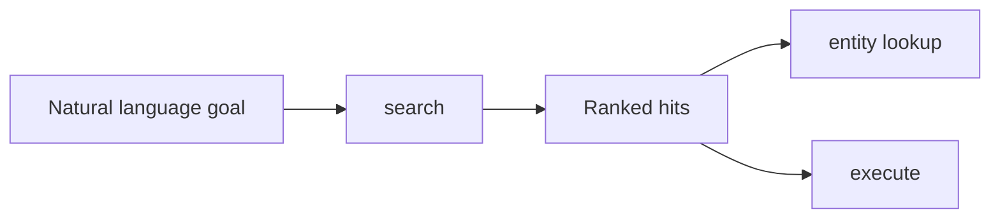

# Kody

## MCP as **personal runtime**, not chat magic

How capability discovery, execution, and UI turn MCP into something you **live
in**.

<!--
Open with the thesis: the interesting part is the protocol + runtime, not “the model guessed right.”
-->

---

# The usual agent demo problem

- Heavy reliance on **one-shot cleverness**
- Hard to reproduce; hard to **trust**
- Integrations become **paste-your-key** theater

**Inference can help — but it is not where MCP wins.**

<!--
Contrast with your goal for this talk: show durable value even when the model is “dumb.”
-->

---

# Kody’s small surface

| Tool                | Role                                                         |
| ------------------- | ------------------------------------------------------------ |
| `search`            | Discover capabilities, **skills**, **apps**, secret _names_  |
| `execute`           | Run **async** sandbox code calling `codemode.<capability>()` |
| `open_generated_ui` | Dashboards, forms, OAuth callbacks — **no secrets in chat**  |

<!--
Point to docs/use/first-steps.md in Q&A; keep this slide sparse.
-->

---

# Discovery — `search`

- Ranked results: capabilities, saved skills, saved apps, secret references
- **`entity: "id:type"`** for full schema on one hit
- Thin results → rephrase or **`meta_list_capabilities`**

<!--
Emphasize: vectorization may help search, but the win is structured discovery + schemas.
-->

---

# Runtime — `execute`

- One **`execute`** can **chain** multiple capability calls
- Optional injected **`params`** for structured inputs
- Saved workflows → **`meta_run_skill`** / **`meta_save_skill`**

**Deterministic composition** over the capability graph — not prose luck.

<!--
Mention fetch + secret placeholders only in approved contexts; next slides cover trust.
-->

---

# Repeatable work — **skills**

- **`meta_save_skill`** — codemode you expect to run again
- Collections, parameters, **`meta_run_skill`**
- Example angle: **Cursor agent status**, **open GitHub PRs from agents**

<!--
Name your real skill names if comfortable; otherwise keep generic.
-->

---

# Personal software — **generated UI**

- **`ui_save_app`** — persist UI; reopen with **`open_generated_ui`**
- **`kodyWidget`** + **`executeCode`** for server-side fetches with policy
- **Saved apps** can stay **hidden** from search until you opt in

**Dashboards are first-class — not markdown decoration.**

<!--
Reference docs/contributing/mcp-apps-spec-notes.md: hosted `/ui/:id` for OAuth callbacks.
-->

---

# Secrets & OAuth — **for real systems**

- **Never paste secrets in chat** — use **`/connect/secret`** or UI
- Third-party OAuth: hosted **`/connect/oauth`** (not MCP-to-Kody OAuth)
- **`{{secret:…}}`** only where allowed; **host approval** is separate from
  saving

Official guides load via **`kody_official_guide`** (`oauth`, `connect_secret`,
`generated_ui_oauth`).

<!--
This is the “adult supervision” slide for integrators in the room.
-->

---

# Not toy examples

These are **production-shaped** artifacts in my Kody account:

- **Cursor Agent PR dashboard** — Cursor + GitHub, polling, CI context
- **Tesla Energy Live** — OAuth, live energy data
- **Skills** — agent status, open PRs, follow-up on an agent, Cloudflare API v4

Add `public/demo/cursor-pr-dashboard.png` (and optionally `tesla-energy.png`)
after export.

<!--
Repo ships a 1×1 placeholder PNG so production builds succeed; swap in a real screenshot before presenting.
-->

---

# Walkthrough — **PR + agent observability**

1. **Search** finds the saved app + related skills
2. **Open** the hosted saved app URL in the browser
3. UI uses **`kodyWidget.executeCode`** → secret-backed API calls
4. **Skills** automate the same sources for “check status” workflows

**Same integrations, two surfaces: UI + script.**

<!--
This is the narrative spine of the talk; spend most demo time here if live.
-->

---

# Guardrails & trust

- **Mutations**: confirm method, path, body before POST/PUT/PATCH/DELETE
- **Secrets**: metadata via **`codemode.secret_list`** — not raw values in
  results
- **Memory**: **`meta_memory_verify`** before upsert/delete
- **Identity**: tokens belong to the **configured Kody account**, not
  necessarily “the user’s laptop user”

<!--
Cite docs/use/mutating-actions.md and docs/use/memory.md briefly.
-->

---

# Takeaway

**MCP’s payoff is composable, policy-aware infrastructure** you reopen every
week —

not a single impressive model reply.

<!--
Thank you / Q&A. Offer links: heykody.dev, docs/use/index.md, this repo.
-->

---

## layout: center

# Live demo cheat sheet

1. **`search`** — e.g. “list capabilities” or a neutral read-only capability
   name
2. **`execute`** — one function, multiple `codemode.*` calls if useful
3. **Stop before secrets** — show **`/connect/secret`** or **`/connect/oauth`**
   in the deck, not keys on stage

<!--
Appendix slide — use if you have extra time; keeps the main deck at 12 slides + this optional 13th.
-->
