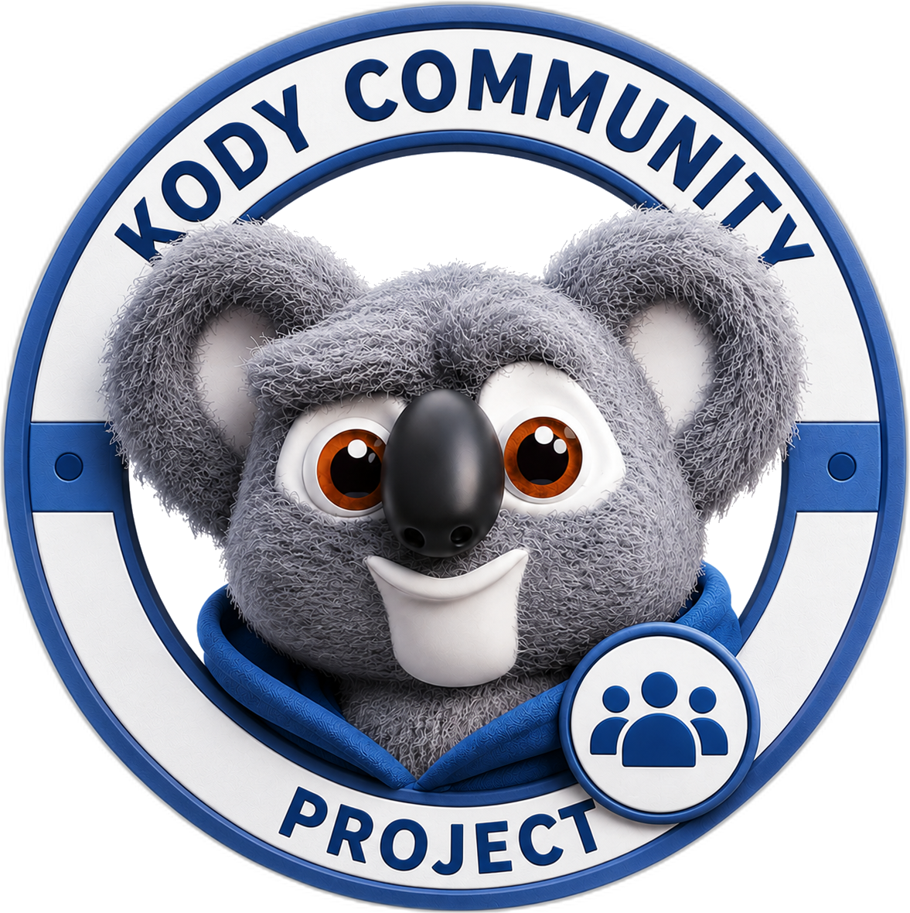

# Kody Community Project mark

Third-party projects that integrate with or extend Kody can use the **Kody
Community Project mark** to show they are community-built, not official Kody
products.

[Download the mark (PNG)](./assets/kody-community-project-mark.png)

## What it is for

Use this mark when you ship something that works **with** Kody but is **not**
maintained by the official Kody project — for example:

- Shortcuts, widgets, or mobile bridges
- Community clients, plugins, or host integrations
- Open-source tools that call Kody over MCP

The mark gives you a recognizable visual identity while making the unofficial
status obvious to users.

## Official vs community

|                     | Official Kody                                                             | Community project          |
| ------------------- | ------------------------------------------------------------------------- | -------------------------- |
| Maintainer          | The [kody](https://github.com/kentcdodds/kody) repository and its deploys | You or your team           |
| Visual identity     | The official Kody logo and product UI                                     | The Community Project mark |
| Implies endorsement | Yes                                                                       | No                         |

Do **not** use the official Kody logo, app icon, or product screenshots in ways
that suggest your project is official. Use the Community Project mark instead.

## How to use the mark

1. **Use the mark** for app icons, README badges, store listings, and marketing
   where space allows.
2. **Alter the mark if you need to.** Recolor, restyle, crop, or otherwise adapt
   it, as long as the community label stays intact and readable. That label —
   the ring text that names this a community project, or an equally clear
   community label — is what tells users the project is unofficial.
3. **Name your project clearly.** Prefer names like “Kody Bridge for iOS” or
   “Acme’s Kody Toolkit” rather than plain “Kody.”
4. **Include attribution** wherever you show the mark or describe the
   integration — for example in an About screen, README, or app store
   description:

   > Kody is a character and brand belonging to
   > [Kent C. Dodds](https://kentcdodds.com). This project is community-built
   > and is not affiliated with or endorsed by the official Kody project.

## What this does not grant

The mark is a courtesy for community builders. It does **not**:

- Transfer ownership of the Kody name, character, or brand
- Constitute official endorsement of your project
- Grant trademark rights beyond fair community use with clear attribution

If you are unsure whether your use is appropriate, open a discussion in the
[kody repository](https://github.com/kentcdodds/kody/discussions).

## Questions

For bugs or features in **official** Kody, use GitHub issues on the main repo.
For **your** community project, maintain your own support channel and link back
to Kody only as an integration dependency.
